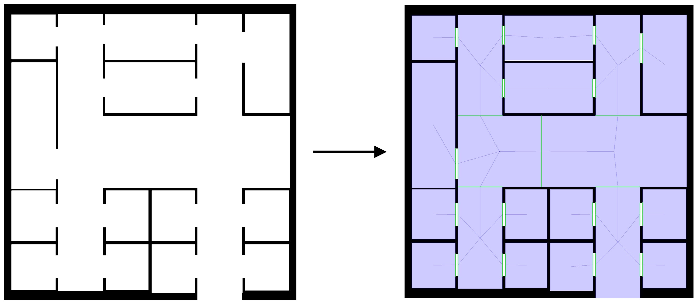
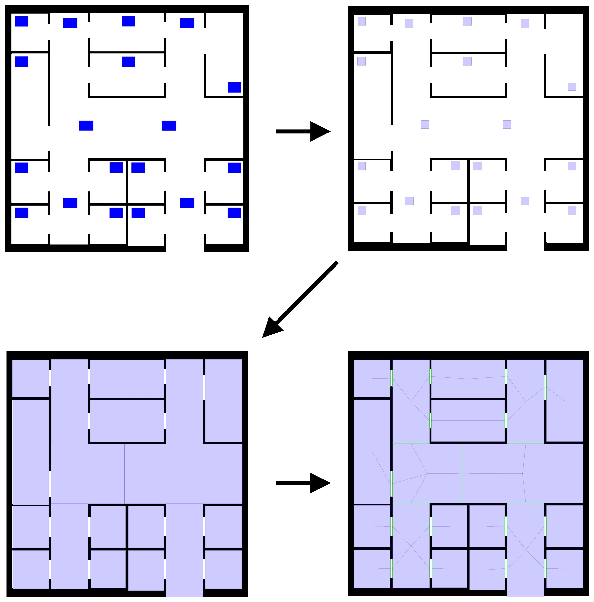

---

title: Generating navigation graphs

---
A navigation graph of an environment is a graph whose nodes are convex shapes representing portions of the environment which are traversable by agents (namely, walkable areas), and edges represent connections between them. The image below shows a bidimensional environment with obstacles on the left and the associated navigation graph on the right (nodes are painted blue whereas edges are represented as line segments connecting the centroid of the node to the associated crossing, which is painted green).



Navigation graphs are mainly used for navigation purposes (e.g. in pathfinding algorithms): the advantage of decomposing the environment into convex regions lies in the fact that agents can freely walk around within a convex region, as it is guaranteed that no obstacle will be found (remember that a shape is convex when no line segment between any two points on its boundary ever goes outside the shape). 

Alchemist is capable of generating navigation graphs of bidimensional environments featuring euclidean geometry and double precision coordinates. Before diving into the topic, please be aware that the algorithm implemented in Alchemist for the generation of navigation graphs:
- Does not guarantee the coverage of 100% of the walkable area (as the image above shows).
- Is only capable to detect axis-aligned crossings.
- Is only capable to deal with convex polygonal obstacles. Concave ones can be decomposed into convex meshes, whereas for curves bounding boxes can be used, eventually arbitrarily-oriented minimum bounding boxes.

### NaviGator

The algorithm implemented in Alchemist is called NaviGator (Navigation Graphs generAtor), here's a brief description of how it operates: firstly, a certain number of seeds is planted in the environment. Each seed is a square-shaped region of unitary side that will grow maintaining a convex shape. Secondly, planted seeds are extended until possible (i.e. until they are in contact with an obstacle or another seed on each side). Finally, crossings are found between the grown seeds. NaviGator is derived from the [DEACCON algorithm](https://www.researchgate.net/profile/G_Youngblood/publication/220978343_Automatically-generated_Convex_Region_Decomposition_for_Real-time_Spatial_Agent_Navigation_in_Virtual_Worlds/links/54510d020cf24884d886f643/Automatically-generated-Convex-Region-Decomposition-for-Real-time-Spatial-Agent-Navigation-in-Virtual-Worlds.pdf) for the generation of navigation meshes.

### Generating navigation graphs from images

If your environment is codified as an image (such as the planimetry showed above), generating a navigation graph is straight-forward. All you have to do is mark the areas of the environment where to plant initial seeds in blue (RGB #0000FF). In the image below you can see the generation of the navigation graph showed on the top of the page. The rectangular blue regions in the original image inidicate where to plant initial seeds. These are then grown and crossings are found between them.



Once you have your image ready for the generation of the navigation graph, you can exploit the `ImageEnvironmentWithGraph` class to produce it for you. This will read your image, extract the positions you marked blue and pass them to the NaviGator algorithm. In other words, that class is capable of reading the visual format we defined in the previous paragraph. Assuming you already know [how to write simulations in YAML](yaml.md), instancing an `ImageEnvironmentWithGraph` in a simulation file is straight-forward:
```yaml
environment:
  type: ImageEnvironmentWithGraph
  parameters: [path/to/image.png, 1.0]
```
The second parameter is the zoom level. As you may see in the API documentation, the `ImageEnvironmentWithGraph` class exposes a method that will allow you to obtain the generated graph.

#### Destinations

In Alchemist, navigation graphs can store a set of positions of interest that may be used during navigation (e.g. destinations in an evacuation scenario). You can specify one or more positions of interest providing the coordinates in the constructor of `ImageEnvironmentWithGraph`:
```yaml
environment:
  type: ImageEnvironmentWithGraph
  parameters: [path/to/image.png, 1.0, 50, 50]
```
The code above will place a position of interest in (50, 50).

#### Drawing navigation graphs

A simple effect capable to draw the navigation graph of an `ImageEnvironmentWithGraph` in the gui is available as well. Its name is `DrawNavigationGraph`, you can just select it from the available effects in the gui to have your graph drawn.

### Using NaviGator 

If your environment is not codified as an image, you can still generate a navigation graph by directly using the NaviGator algorithm. This is contained in the `NaviGator.kt` file whose only public function is `generateNavigationGraph`. Let us look at its signature:
```kotlin
fun generateNavigationGraph(
    origin: Euclidean2DPosition = Euclidean2DPosition(0.0, 0.0),
    width: Double,
    height: Double,
    obstacles: Collection<Shape>,
    rooms: Collection<Euclidean2DPosition>,
    unity: Double = 1.0,
    destinations: List<Euclidean2DPosition>
): Euclidean2DNavigationGraph
```
Here's a brief description of each parameter:
- `origin`: the origin of the environment, defaults to (0,0).
- `width`: the width of the environment (only positive).
- `height`: the height of the environment (only positive).
- `obstacles`: the obstacles of the environment (only convex polygonal obstacles are supported).
- `rooms`: a collection of positions where to plant initial seeds. In indoor environments, these positions are usually located inside rooms (and corridors), hence the name of the parameter.
- `unity`: the quantity considered to be a unit in the environment (defaults to 1.0 because this algorithm works best with environments featuring integer coordinates). In the growing phase, each side of each seed will be advanced of a quantity equal to unity iteratively, hence the smaller this value is the slower the algorithm will be.
- `destinations`: a collection of positions of interest that will be stored in the navigation graph and may be used during navigation (e.g. destinations in an evacuation scenario).
