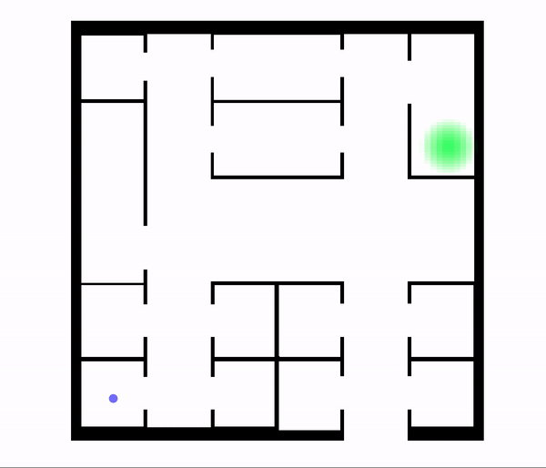

+++
title = "Cognitive Agents"
weight = 5
tags = ["cognitive", "pedestrian", "agents"]
summary = "Agents with realistic human behavior."
+++

Alchemist is capable of simulating the movement of pedestrians with sophisticated cognitive capabilities:

The animation above shows an adult male with no previous knowledge of the environment trying to reach the destination marked green.

## Types of pedestrian
There are three basic types of pedestrian,
each representing a more sophisticated version of the previous one.
These are derived from the work of [van der Wal et al](https://doi.org/10.1007/978-3-319-70647-4_11).

1. Homogeneous Pedestrians:
   {}s with no peculiar characteristic.
2. Heterogeneous pedestrians have an age and a gender,
   based on which their speed,
   compliance to rules,
   and social attitudes are computed.
3. Cognitive pedestrians are heterogeneous pedestrians with cognitive capabilities.
   They have an emotional state and are able to influence and be influenced by others
   with the same capabilities.
   As an example, cognitive pedestrians can perceive fear via social contagion
   (e.g. seeing other people fleeing may cause them flee as well regardless of whether they've seen the danger directly).
4. Orienting pedestrians, as shown in the animation on the top of the page,
   can be equipped with different knowledge degrees of the environment.
   To do so, a particular type of pedestrian called orienting pedestrian is required:
   this is derived from the work of
   [Andresen et al](https://www.tandfonline.com/doi/full/10.1080/23249935.2018.1432717).

## Types of behaviors

There are two macro-categories of behaviours:
- those inspired to [Reynold's steering behaviors](https://archive.is/fkUpJ),
  which operate in a greedy fashion, i.e. performing only local choices;
- those inspired to the work of [Andresen et al](https://www.tandfonline.com/doi/full/10.1080/23249935.2018.1432717),
  which exploit the spatial information available to orienting pedestrians
  in order to navigate the environment consciously
  (e.g. without getting stuck in U-shaped obstacles).
  Note that these actions *do not* assume that pedestrians have global knowledge of the environment,
  on the contrary only the spatial information available to a pedestrian is used to move it
  (which can be little or nothing).

## Navigation memory model

Each time a pedestrian enters a new room (= environment's area),
all the visible doors are weighted,
the one with minimum weight is then crossed.
The weighting system used in Alchemist is derived from the one by
[Andresen et al](https://doi.org/10.1080/23249935.2018.1432717),
here's a brief description of the factors included,
these are multiplied to get the final weight.

| Name                 | Description                                                                                                                                                                                                                                                                                                                                                                                            |
|----------------------|--------------------------------------------------------------------------------------------------------------------------------------------------------------------------------------------------------------------------------------------------------------------------------------------------------------------------------------------------------------------------------------------------------|
| volatileMemoryFactor | Takes into account the information stored in the pedestrian's volatile memory (= a map pairing each room with the number of visits, models the ability to remember areas of the environment already visited since the start of the simulation). It is computed as 2^v where v is the number of visits to the area the edge being weighted leads to (in other words, less visited rooms are preferred). |
| congestionFactor     | Takes into account the congestion of the area the edge being weighted leads to (it is assumed that the pedestrian can estimate the congestion level of a neighboring room). It is computed as density of the area + 1, so as to have a value in [1,2] (less crowded rooms are preferred).                                                                                                              |
| impasseFactor        | Takes into account whereas a door leads to a known impasse or not, known impasses are given _knownImpasseWeight_ (see hardcoded parameters below), otherwise this factor assumes unitary value.                                                                                                                                                                                             |
| suitabilityFactor    | This factor is used when the pedestrian is moving towards a target: each door is given an integer rank indicating its suitability in order to reach the target (ranks are computed taking into account the target and the door locations, as well as the geometry of the current room). The factor for each door is computed as 1-0.5^rank.                                                            |

## Physical pedestrians

Physical pedestrians are capable of pushing and bumping into each other.
Physical pedestrians are inspired to [the work of Pelechano et al](https://bit.ly/3e3C7Tb).

## Further references
[C. Natalie van der Wal, Daniel Formolo, Mark A. Robinson, Michael Minkov, Tibor Bosse\
Simulating Crowd Evacuation with Socio-Cultural, Cognitive, and Emotional Elements\
Transactions on Computational Collective Intelligence XXVII. 2017.](https://doi.org/10.1007/978-3-319-70647-4_11)

[Craig W. Reynolds\
Steering Behaviors for Autonomous Characters. 1999.](http://citeseer.ist.psu.edu/viewdoc/summary?doi=10.1.1.16.8035)

[Erik Andresen, Mohcine Chraibi & Armin Seyfried\
A representation of partial spatial knowledge: a cognitive map approach for evacuation simulations](https://www.tandfonline.com/doi/full/10.1080/23249935.2018.1432717)

[Nuria Pelechano, Jan M. Allbeck, Norman I. Badler\
Controlling Individual Agents in High-Density Crowd Simulation](https://repository.upenn.edu/cgi/viewcontent.cgi?article=1223&context=hms)