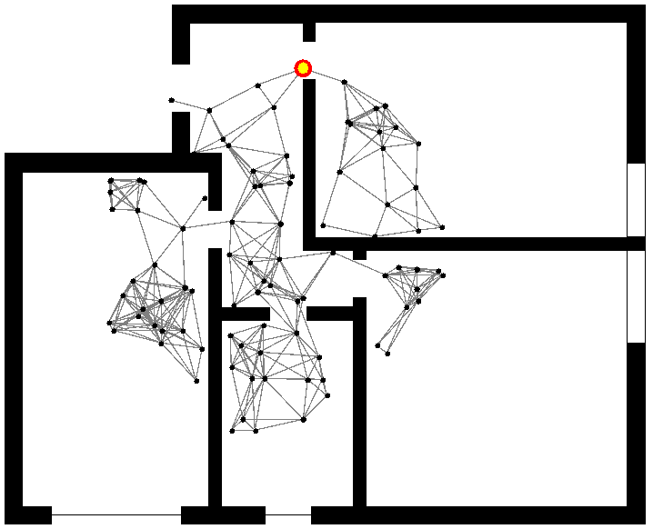

+++
title = "Simulate indoor"
weight = 5
tags = ["environment", "planimetry", "indoor"]
summary = "How to create indoor environments based on planimetries."
+++

Indoor environments
(bidimensional spaces with obstacles)
can be generated from images by leveraging
{},
which loads the map as raster image from file,
interpreting the black pixels as obstacles
(wall-like areas not accessible to nodes).
Color of pixels that represents obstacles can be set to
every color with a constructor's parameter, black is default.

By default, each pixel is considered as a 1x1 block.
As a consequence, a 1200x600 image with a vertical line of black pixels at coordinate 500 will be interpreted as a single
obstacle of size 1x600 starting at coordinate (500, 0).
It is possible to scale up or down the size of the environment by acting on the zoom parameter of
{},
as well as changing the initial coordinates.

## Examples

{}


---

{}


---

{}


---

{}

* Direct reference to the image
  
* Search for the image in the file system via Kotlin
  
