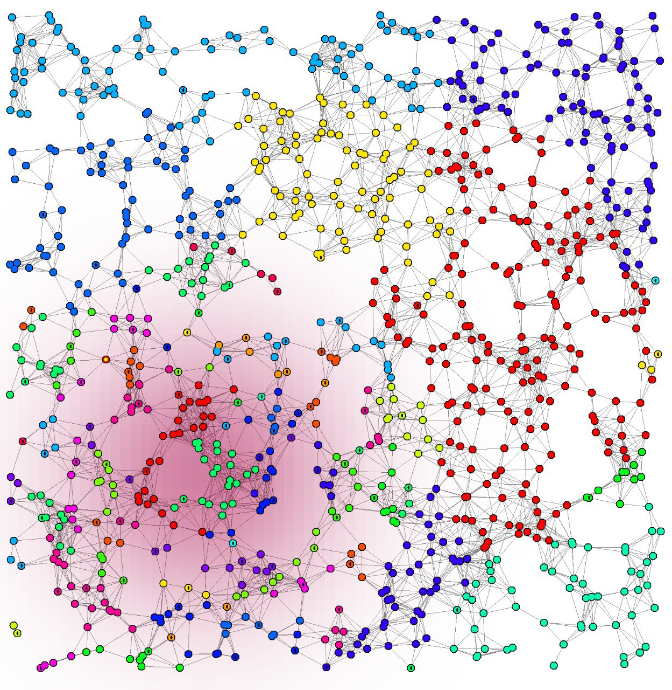

+++
title = "Create Layers"
weight = 5
tags = ["layer", "layers", "data", "pollution", "light", "temperature"]
summary = "Define data layers that live in the environment"
+++

It is possible to define overlays (layers) of data that can be sensed everywhere in the environment.
Layers can be used to model physical properties, such as pollution, light, temperature, and so on.
As opposed to nodes' contents, layers have no dependency optimization.
This implies that reactions that read values from layers should have special care in defining their `context` appropriately.

Layers are created with the [`type/parameter` syntax](/reference/yaml/#arbitrary-class-loading-system),
as in this example:



The following example shows the syntax for initializing multiple
{}s:



If the target layer is written in Kotlin, it can be loaded using named parameters,
which arguably reads more clearly.


