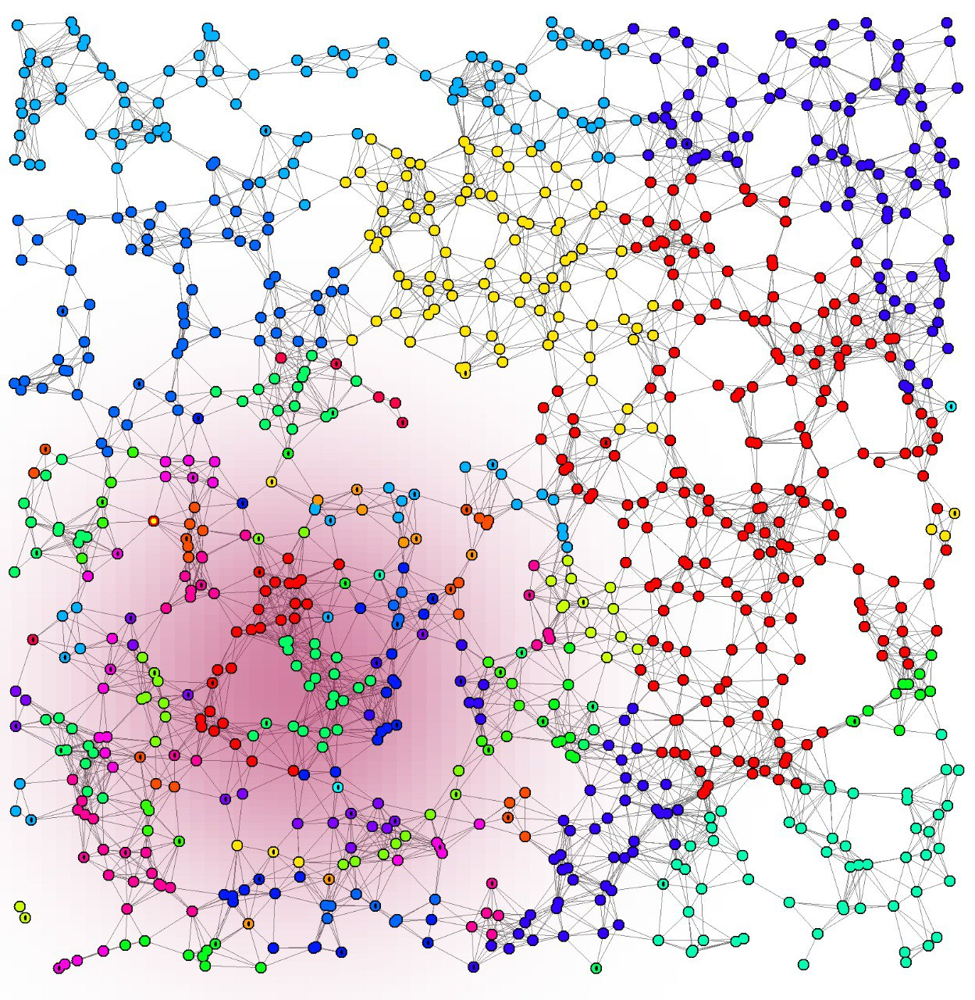

+++
title = "Create Layers"
weight = 5
tags = ["layer", "layers", "data", "pollution", "light", "temperature"]
summary = "Define data layers that live in the environment"
+++

It is possible to define overlays (layers) of data that can be sensed everywhere in the environment.
Layers can be used to model physical properties, such as pollution, light, temperature, and so on.
Layers belong to the environment setup: each molecule is associated with at most one layer,
and no layer can be associated once the environment is part of a running simulation.

A {} maps each position to a value that may change over time:
its `observeValue` notifies every change of the value at a position.
{}'s `observeLayerValue` observes a layer at the position of a node:
it notifies a new value whenever the node moves to a position with a different value,
or the layer changes the value at the node's current position.
Layers whose spatial distribution never changes, such as
{},
{}, and
{},
notify changes only through the movement of the observing node.
Reactions whose scheduling depends on a layer subscribe to these observables
and publish the resulting changes through their `nextOccurrence`, as described in
[Reaction Scheduling and Ownership](/explanation/metamodel/reaction-scheduling/).

A custom layer whose spatial distribution never changes extends
{} and implements only `getValue`.
A layer whose values change over time implements `observeValue` instead:
the returned observable emits every new value at the observed position,
and `getValue` reads its current value.

Layers are created with the [`type/parameter` syntax](/reference/yaml/#arbitrary-class-loading-system),
as in this example:



The following example shows the syntax for initializing multiple
{}s:



If the target layer is written in Kotlin, it can be loaded using named parameters,
which arguably reads more clearly.


