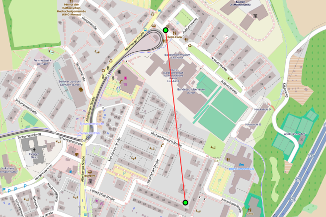
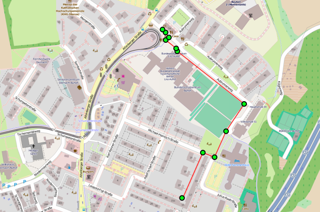
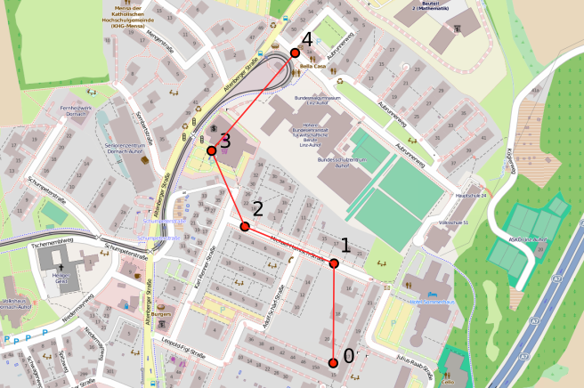
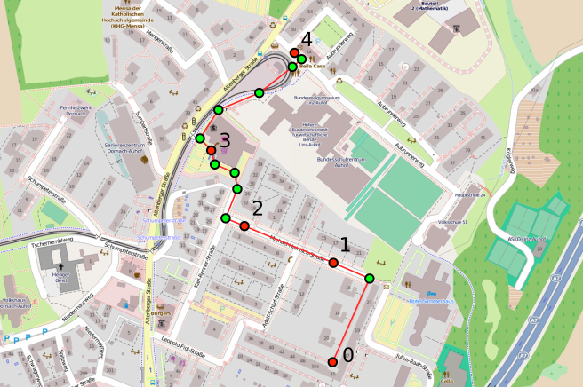

+++
title = "Move nodes on maps"
weight = 5
tags = ["reaction", "program", "behavior", "maps", "gps", "interpolation", "geospatial"]
summary = "How to move node around in geospatial environments."
+++

There are several possibilities to move nodes in gep-spatial environment.

## Ignore geo-spatial information

This is of course the easiest way:
all data about the map is ignored.
This strategy makes sense if you need a geo-spatial coordinate system,
but you are simulating objects that are mostly or entirely unaffected by the street-level structure
(buildings, roads, etc.);
for instance, if the simulation involves unmanned aerial vehicles.
There is no need of [importing actual map data](../../environment/maps) when navigating this way.

This kind of navigation can be realized using
{}.

### Examples





**From the showcase**

[Optimal resilient distributed data collection in mobile edge environments](/showcase/2020-jcee)

## Navigate along the streets

Moves along the available paths, depending on the specific vehicle being used.
Requires actual geo-spatial information.

This kind of navigation can be realized using
{}.

## Reproduce a GPS Trace

Ignores the map geospatial information and relies on a GPS trace instead,
starting from its first position and reaching the last,
navigating from point to point in "straight lines"
(on maps, these are actually [orthodromes](https://en.wikipedia.org/wiki/Great-circle_distance)).

This kind of navigation can be realized using
{}.

{}
You probably want your nodes to *start* from the position that marks the beggining of a trace.
We discussed [how to do so here](/howtos/simulation/deploy/gps).
{}

{}
Navigation with GPS traces usually require that they get correctly aligned with time,
especially if they come from samples taken at different times.
We discussed the alignment of GPS traces [here](/howtos/simulation/deploy/gps/#alignment-of-time),
the same alignment system used for importing traces is used for using them during navigation.
{}

### Examples



### Interpolate GPS traces with street data

Navigates along a GPS trace, but computes the point-to-point distance using the navigation system,
rather than "straight lines" ([orthodromes](https://en.wikipedia.org/wiki/Great-circle_distance)).

This kind of navigation can be realized using
{}.
