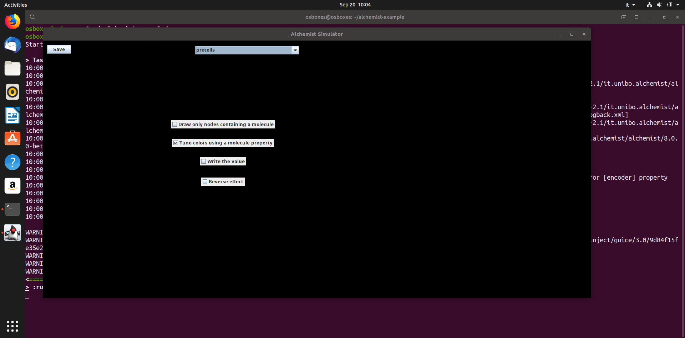
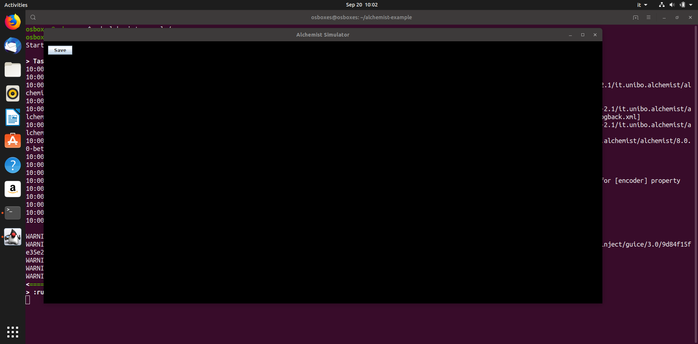
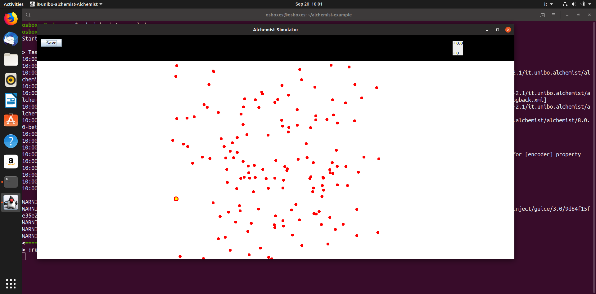

+++
pre = ""
title = "Graphical Glitches in Swing"
weight = 5
tags = ["swing", "gui", "artefacts", "opengl", "driver", "video"]
summary = "Known issues with Swing and OpenGL acceleration, especially with legacy AMD/ATi drivers."
+++

Under some combination of hardware and drivers, the Swing interface may render uncorrectly.
This is due to Alchemist using OpenGL as rendering backend for Swing, in order to increase performance.

{}

{}

## Solution

Disable the OpenGL acceleration explicitly by setting the `sun.java2d.opengl` property to `false`.

### Gradle

With Gradle, edit the Alchemist launch task
(which should be a [`JavaExec`](https://docs.gradle.org/current/dsl/org.gradle.api.tasks.JavaExec.html))
by adding:
[``jvmArgs("-Dsun.java2d.opengl=false")``](https://docs.gradle.org/current/dsl/org.gradle.api.tasks.JavaExec.html#org.gradle.api.tasks.JavaExec:jvmArgs(java.lang.Iterable))

### Stand-alone

Add the appropriate JVM option:

``java -Dsun.java2d.opengl=false -jar alchemist-full.jar``
