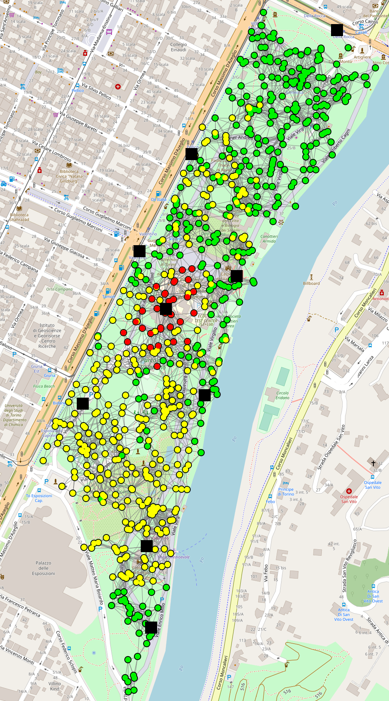
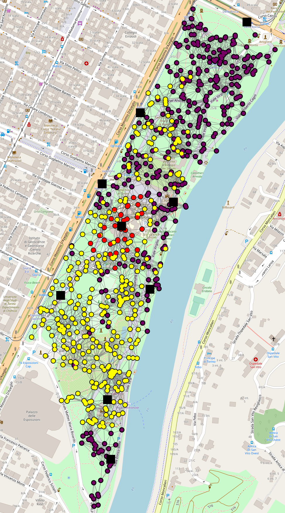
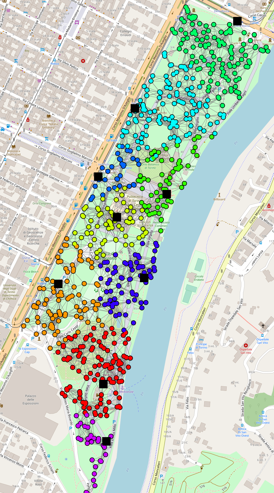
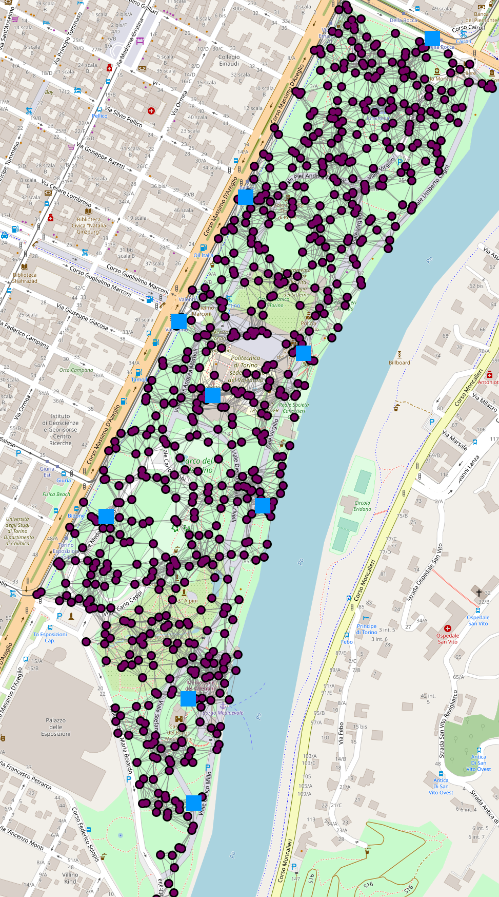

+++
pre = ""
title = "2020: Optimal resilient distributed data collection in mobile edge environments"
weight = 5
summary = "Simulation of crowd control with mobile in Turin."
tags = ["experiment", "maps", "export", "protelis"]
hidden = true
+++

Scientific publication: {}

Experiment publicly available at [https://github.com/DanySK/Experiment-2021-JCEE-Optimal-Converge-Cast](https://github.com/DanySK/Experiment-2021-JCEE-Optimal-Converge-Cast)

## Notes

This experiment uses Alchemist experimental version `10.0.0-dev0z+a6d7708ef`.

## Abstract

A key goal of edge computing is to achieve “distributed sensing” out of data continuously generated from a multitude of interconnected physical devices.
The traditional approach is to gather information into sparse collector devices by relying on hop-by-hop accumulation, but issues of reactivity and fragility naturally arise in scenarios with high mobility.
We propose novel algorithms for dynamic data summarisation across space, supporting high reactivity and resilience by specific techniques maximising the speed at which information propagates towards collectors.
Such algorithms support idempotent and arithmetic aggregation operators and, under reasonable network assumptions, are proved to achieve optimal reactivity.
We provide evaluation via simulation: first in multiple scenarios showing improvement over the state of art, and then by a case study in edge data mining, which conveys the practical impact in higher-level distributed sensing patterns.

## Experiment description

To exemplify practical applications, we test the proposed algorithms in a realistic setup of mobile edge computing.
We focus on crowd tracking, the process of monitoring the evolution of large assembles of people, with the goal of keeping crowd density under control to prevent dangerous situations.
We shall show how such monitoring can be performed fully at the edge of the network. Consider a scenario of crowd tracking in the Italian city of Turin,7 especially pushed after the famous June 2017 incident, when a panic wave and stampede emerged resulting in casualties and injuries [19]. We set up a large event in the popular public park “Parco del Valentino”, with an area of roughly . Suppose a small fraction of participants are equipped with wearable devices given by the organisation, capable of local peer-to-peer communication.

As reference hardware, we model the communication capabilities of the DecaWave DWM1001 Development Board.8,9 The board features two radio devices, based respectively on Bluetooth Low Energy (BTLE) and on a custom implementation of an Ultrawide Band (UWB) transceiver (IEEE 802.15.4-2011). The BTLE radio is used to exchange identification beacons, while the UWB module is used to communicate directly with devices in proximity, creating a mesh network. The current implementation reaches a communication range of several tenths of metres, and a data rate in the order of few megabits per second. The device is designed to be easily attachable to small-size, low-power ARM boards, such as the Raspberry PI zero, with enough computational power to sustain a full fledged operating system such as Android or GNU/Linux.

In our scenario, nine edge servers are displaced at key locations in the park corresponding to existing facilities. The system goal is to provide edge servers with data for predicting the evolution of the local crowd movement, so that field operators can be informed timely about risky situations. Devices can access their position with reasonable accuracy. Our goal is to estimate the density and barycentre of the local crowd in order to detect risky areas. We run an estimation of the local density, and propagate a warning to devices in potentially risky areas: such data can be used to generate short- and mid-terms density estimates [20].

The case study has been open-sourced for reproducibility, configured with a continuous integration system, and released as DOI objects [21]. Table 3 summarises all the variables, constants, and metrics. To challenge our proposed algorithms, we include three elements of realism and a disturbance: (1) a packet loss model, with the probability of a packet not being received growing with distance;  (2) variability in the device working frequency, to emulate unpredicted scheduling policies, e.g., for battery saving;  (3) people are not stationary, but move towards random waypoints within the park at a speed of  [22];  (4) once the system initial transient is terminated, we progressively turn off all edge servers, shutting down one edge server every 100 s. We measure two parameters: the probability that a device is found in an area where density is growing towards a potentially dangerous level (), and the overall error of the system in identifying the barycentre of the tracked crowd (), compared to the value produced by an oracle.

## Snapshots

