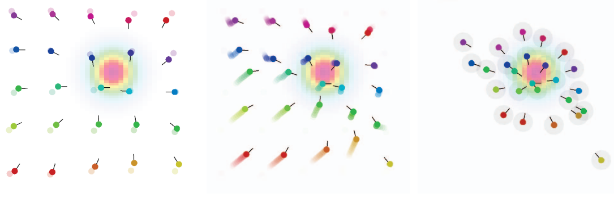

+++
pre = ""
title = "2023: Field-informed Reinforcement Learning of Collective Tasks with Graph Neural Networks"
weight = 4
summary = "Simulations demonstrating field-informed reinforcement learning for collective tasks using graph neural networks and aggregate computing."
tags = ["simulation", "aggregate computing", "reinforcement learning", "graph neural networks", "collective behavior"]
hidden = true
+++

From 

Simulation publicly available at [https://github.com/AggregateComputing/experiment-2023-acsos-field-informed-rl](https://github.com/AggregateComputing/experiment-2023-acsos-field-informed-rl)

## Abstract

Collective tasks in multi-agent systems require agents to coordinate and adapt to dynamic environments.
Traditional reinforcement learning approaches often struggle with scalability and generalization
when dealing with large numbers of agents and varying spatial configurations.

This work presents a novel approach that combines field-based coordination (from aggregate computing)
with graph neural networks (GNNs) for learning collective behaviors.
The key insight is to leverage the spatial structure of agent interactions,
represented as dynamic graphs,
to inform the learning process.
By incorporating field-based abstractions into the state representation,
agents can learn policies that are more robust and scalable.

The approach is implemented using aggregate computing principles and graph neural networks,
enabling agents to learn coordinated behaviors while maintaining spatial awareness.
Experiments demonstrate that this field-informed approach leads to faster convergence
and better generalization compared to traditional multi-agent reinforcement learning methods.

The simulations are built using Alchemist with ScaFi for aggregate computing and Pytorch Geometric for GNNs.

## Experiment description

The experiments evaluate the proposed approach across several collective coordination tasks:

### Task Scenarios

The evaluation focuses on scenarios requiring spatial coordination among multiple agents:
- **Formation control**: Agents learn to maintain specific geometric formations while moving
- **Coverage tasks**: Agents coordinate to efficiently cover an area
- **Collective navigation**: Groups of agents learn to navigate while maintaining cohesion

Each scenario is designed to test different aspects of collective behavior:
- Scalability to varying numbers of agents
- Adaptation to dynamic environments
- Generalization to new spatial configurations

### Learning Architecture

The system combines:
- **Field-based state representation**: Agents perceive their environment through computational fields,
  representing spatial properties like distance gradients and local density
- **Graph Neural Networks**: The GNN architecture processes the agent interaction graph,
  where edges represent communication or sensing relationships
- **Decentralized execution**: Each agent uses the learned policy independently,
  relying only on local information and neighbor communication

### Training Process

Agents are trained using multi-agent reinforcement learning with:
- Centralized training for coordination
- Decentralized execution for scalability
- Field-based reward shaping to guide learning toward spatially coherent behaviors

The training leverages the aggregate computing paradigm to provide structured,
spatially-aware information to the learning process,
significantly improving sample efficiency and final performance.

### Results

The experiments demonstrate that incorporating field-based information into GNN-based reinforcement learning:
- Accelerates learning convergence compared to baseline approaches
- Produces more robust policies that generalize across different numbers of agents
- Enables effective coordination in large-scale scenarios (tested with up to hundreds of agents)
- Maintains performance when deployed in dynamic environments

## Snapshots

The following image shows the collective behavior learned by agents during simulation.

  

<em>Visualization of agents coordinating through field-informed GNN policies.</em>

## Citation

