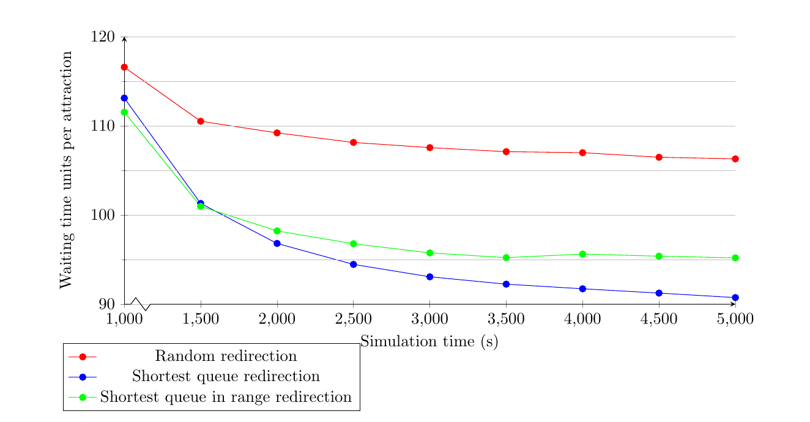
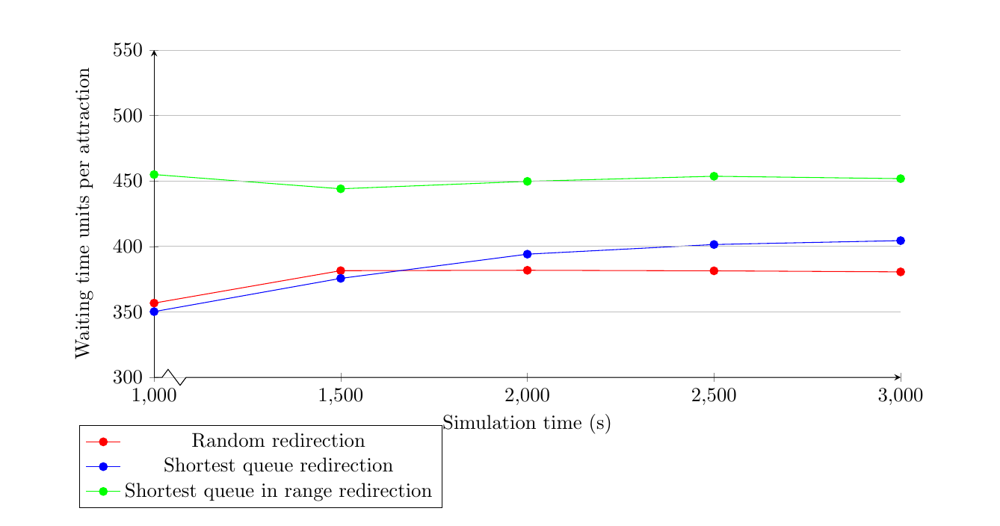

+++
pre = ""
title = "2022: Situated recommendation system"
weight = 5
summary = "Simulation of people attending attractions inside the Mirabilandia amusement park."
tags = ["experiment", "maps", "export", "protelis"]
hidden = true
+++

Experiment publicly available at [https://github.com/ICPS-MicroCity/amusement-park-simulation](https://github.com/ICPS-MicroCity/amusement-park-simulation)

## Notes

This project was developed for the _Intelligent Cyber-Physical Systems_ course.
If you want to have a look at the project, please check the [ICPS-MicroCity organization](https://github.com/ICPS-MicroCity).

## Abstract

The aim of this simulation is to determine whether or not a situated recommendation system can positively affect the visitor flow in an amusement park.
Since the desired system does not exist,
and it would be too costly to implement just for the sake of a proof of concept,
we performed our validation via a simulation.

Amusement parks are a popular form of entertainment for people with diverse ages and interests.
As such,
they offer several attractions,
depending on the park target and theme,
which may include roller-coasters, carousels, and water slides, and so on.
This is one of the reasons why,
especially during holidays,
these parks attract a considerable amount of visitors and tend to be significantly crowded.
Excessive crowding may result in situations far from ideal for visitors,
as chances are that they will have to spend most of their time waiting in queue.
This situation becomes even more unattractive for large groups of visitors,
such as families with children,
or in case of unpleasant weather conditions,
such as rain or summer heat.
Ultimately, a bad experience with the park may reflect into bad reviews,
and hurt the business.
In order to improve the overall visitors’ experience,
the situated recommendation system could suggest
the most suitable attractions for them.

In this scenario,
it could be useful to recommend the most suitable attraction to visitors
depending on their physical location
(as tracked by their personal wearable device)
and/or on their interests.
The recommendations may point to the nearest attraction that suits the visitor’s preferences or to an attraction with a short queue
(compared to the usual queue for the same game or to the queues of other attractions).
This mechanism could be referred as **situated recommendation**.

## Experiment description

To run a realistic setup, we used an existing amusement park:
[Mirabilandia](https://www.mirabilandia.it/en).
Thus, the simulated environment is a real-world map featuring existing paths.

After setting the [_OpenStreetMap_ environment](../../howtos/simulation/environment/maps/), it is essential to deploy nodes on the map. In the current
simulation, the elements that are represented by nodes are:

* **Visitors**, as single individuals or groups; the key point here is that a node should correspond to one or more people using a single wearable device that tracks and guides its
  owner.
* **Attractions**, that can be of different types, such as rides, water slides, restaurants, etc.;
  they are considered _rendezvous_ points for visitors and are made of several sensors that allow
  keeping track of various information, such as the number of people waiting in a queue.

As previously described, the aim of this simulation is to determine whether a situated recommendation
system may help reduce the waiting time needed to benefit from an attraction. In order to achieve
this, the project develops and compares two types of simulations with different redirection policies for the visitors:

* **Random Redirection**: once a visitor
  is satisfied by an attraction, it moves towards another attraction which is chosen randomly among all the ones available in the park.
* **Recommended Redirection**: once
  a visitor is satisfied by an attraction, it moves towards the next one accepting a recommendation. The latter may suggest an attraction if it has a short queue and/or if it is close enough to the visitor.

## Snapshots

## Results

The outcomes of the experiment showed that the _situated recommendation system_ behaves differently depending on the number of visitors. In particular, the expected result is obtained with a lower number of visitors, such as 500. On the other hand, with an higher number, that is 3000 visitors, the average waiting time per attraction increases significantly when using the _situated recommendations_. The following plots show the average waiting time per attraction, that is the time every visitor waits in a queue before attending the attraction, respectively with 500 and 3000 visitors.

