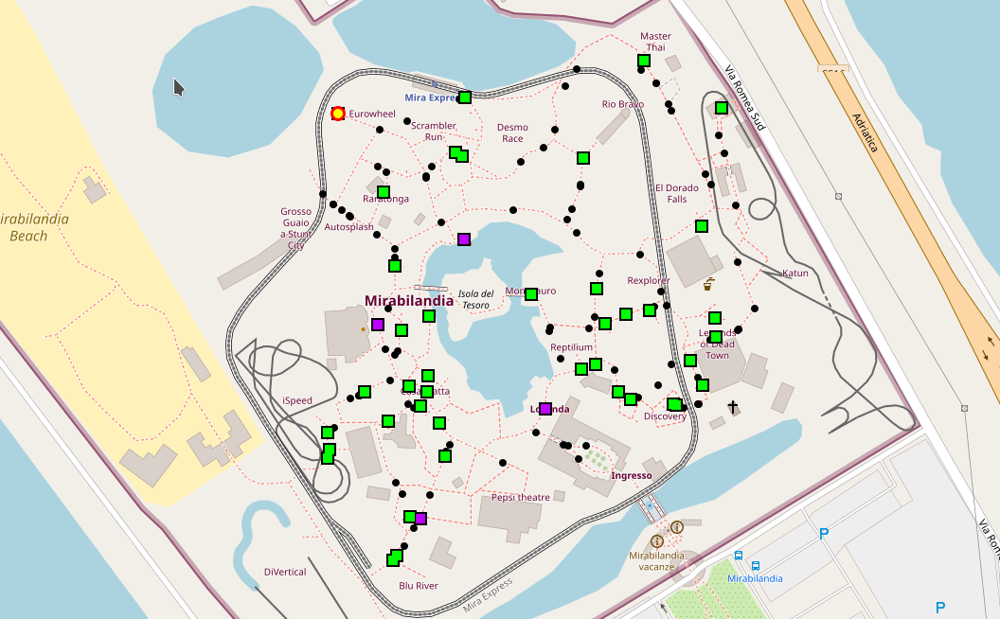
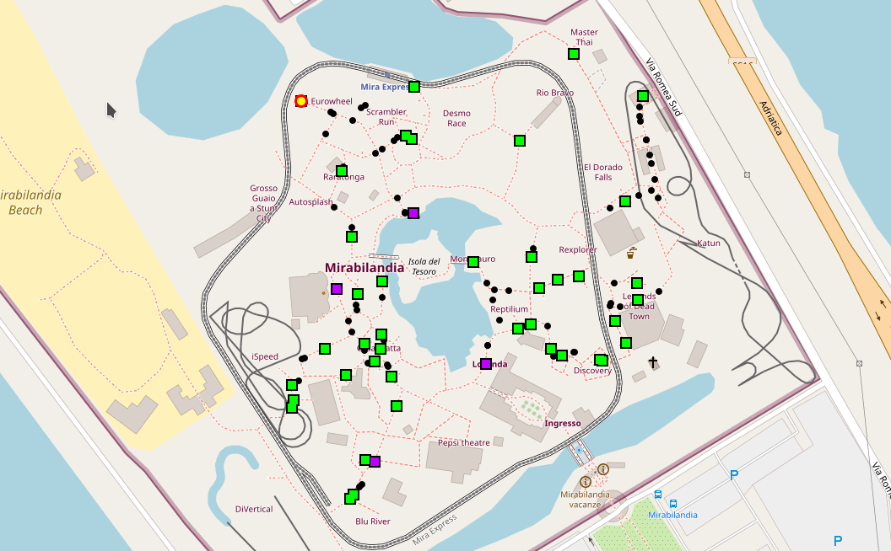

+++
pre = ""
title = "2022: Situated recommendation system"
weight = 5
summary = "Simulation of people attending attractions inside the Mirabilandia amusement park."
tags = ["experiment", "maps", "export", "protelis"]
hidden = true
+++

Experiment publicly available at [https://github.com/ICPS-MicroCity/amusement-park-simulation](https://github.com/ICPS-MicroCity/amusement-park-simulation)

## Notes

This project was developed for the _Intelligent Cyber-Physical Systems_ course. If you want to have a look at the project, please check the [ICPS-MicroCity organization](https://github.com/ICPS-MicroCity).

## Abstract

The aim of this simulation is to determine whether
a situated recommendation system can positively affect the visitor flow in an amusement park or
not. Since the desired system does not exist, and it would be too costly to implement just for
the sake of a proof of concept, the only way to validate the latter theory is through a simulation.

Amusement parks surely represent a popular form of entertainment for people of all ages and
with different interests. Inside, they offer a large set of attractions that may vary depending on the type of amusement park. For instance, they may be roller-coasters, carousels, water slides and many others. This is one of the reasons why, specially during holiday times, these
parks attract a considerable amount of visitors and tend to be significantly crowded. Although
this is greatly profitable for the parks themselves, unfortunately it is not the ideal situation for
the visitors as chances are that they will have to spend most of their time waiting in a queue.
This situation becomes even more unattractive for large groups of visitors, such as families with
children, or under unpleasant weather conditions, such as rain or summer heat. In order to
improve the overall visitors’ experience, the situated recommendation system could suggest
the most suitable attractions for them.

In this scenario, it could be useful to recommend the most suitable attraction to visitors
depending on their physical location, tracked by their personal wearable device, or on their
interests. The recommendations may concern the nearest attraction that suits the visitor’s preferences or an attraction with a short queue (compared to the average queue of the attraction,
or compared to the queues of other attractions). This mechanism could be referred as **situated recommendation**.

## Experiment description

The simulation concerns an existing geographical location, that is the Mirabilandia amusement park. For this reason, the environment of the simulation must be a map featuring existing paths
in the real world.

After setting the _OpenStreetMap_ environment, it is essential to deploy nodes on the map. In the current
simulation, the elements that are represented by nodes are:

* **Visitors**, as single individuals or groups; the key point here is that a node should correspond to one or more people using a single wearable device that tracks and guides its
  owner.
* **Attractions**, that can be of different types, such as rides, water slides, restaurants, etc.;
  they are considered _rendezvous_ points for visitors and are made of several sensors that allow
  keeping track of various information, such as the number of people waiting in a queue.

As previously described, the aim of this simulation is to determine whether a situated recommendation
system may help reduce the waiting time needed to benefit from an attraction. In order to achieve
this, the project develops and compares two types of simulations with different redirection policies for the visitors:

* **Random Redirection**: once a visitor
  is satisfied by an attraction, it moves towards another attraction which is chosen randomly among all the ones available in the park.
* **Recommended Redirection**: once
  a visitor is satisfied by an attraction, it moves towards the next one accepting a recommendation. The latter may suggest an attraction if it has a short queue and/or if it is close enough to the visitor.

## Snapshots

