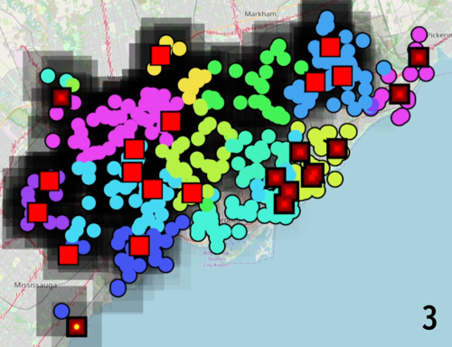

+++
pre = ""
title = "2022: Dynamic Decentralization Domains for the Internet of Things "
weight = 5
summary = "Simulation of collective distributed sensing and acting using Toronto rain gauge's data."
tags = ["experiment", "maps", "export", "scafi"]
hidden = true
+++

<!-- Scientific publication: [https://doi.org/10.1016/j.compeleceng.2021.107580](https://doi.org/10.1016/j.compeleceng.2021.107580) -->

Experiment publicly available at [https://github.com/cric96/experiment-2022-ieee-decentralised-system](https://github.com/cric96/experiment-2022-ieee-decentralised-system)

## Abstract
The Internet of Things and edge computing are fostering a future of ecosystems
hosting complex decentralized computations, deeply integrated with our very dynamic
environments. Digitalized buildings, communities of people, and cities will be the
next-generation “hardware and platform”, counting myriads of interconnected devices, on top of
which intrinsically-distributed computational processes will run and self-organize. They will
spontaneously spawn, diffuse to pertinent logical/physical regions, cooperate and compete,
opportunistically summon required resources, collect and analyze data, compute results, trigger
distributed actions, and eventually decay.
How would a programming model for such ecosystems look like? Based on research findings on
self-adaptive/self-organizing systems, this paper proposes design abstractions based on
“dynamic decentralization domains”: regions of space opportunistically formed to support
situated recognition and action. We embody the approach into a Scala application program
interface (API) enacting distributed execution and show its applicability in a case study of
environmental monitoring.
## Experiment description

In the simulation presented in the paper 
we want to monitor the rain intensity to pre-alert the public
safety organizations close to areas at a risk of
floods.
The tracked phenomenon is spatially and
temporally hard to predict with fine-enough grain
(data from the NOAA1 has, at best, zip-code gran-
ularity): at a single-city level, we could perform
better by promptly reacting to specialized sensors
readings. However, the information provided by
individual sensors is too fragile, as the risk depends 
on the rain intensity in surroundings and
not just on the specific spot (e.g., coastal zones
with a steep elevation profiles could suffer floods
even with light rain, if the close-by higher-altitude
zone is being hit hard). Pre-defining areas (using
pre-existing altimetric and structural knowledge)
helps, but this strategy misses out on essential
information: how the underlying phenomenon is
behaving. Indeed, areas should be formed ad-hoc
considering the city structure and rain distribution, 
and leveraged to perform on-the-fly situation
recognition and response.
This approach is practical whenever there are
phenomena with non-strictly-local effects, irregularly shaped in space, and/or hard-to-predict a
fine grain.

For the simulutaion of rain intensity, we used 
open data of [Toronto](https://bit.ly/3QciJ9i), 
featuring 50 water gauges samples taken in 2021. 
To stress-test our proposed approach with a denser
network of devices, we added 300 simulated
gauges, randomly positioned, whose data is interpolated 
from the values of the surrounding real
devices. We selected the rain event that occurred
on 2021-09-07, the heaviest in the available data.
We used data from OpenStreetMap to position 24 fire stations
In the experiment, devices compute
their programs unsynchronized at a frequency of
1Hz. We define a simple metric for the actual
risk of a location as the quotient of the local
rain intensity on the local altitude (namely, the
rainier and the lower the position, the higher
the risk); we run an oracle measuring it with
a fine grain across the city at each instant. As
performance measure, we count how many alerts
get generated and how many stations they reach.
Additional gauges position and device timing drift
are randomized. 

## Snapshots

Darker shadows indicate heavier rain. Black
squares with a small red dot are unalerted fire
stations, when at least an alert reaches them,
their dot changes to a large red square. Circles
represent gauges; their colors map the region they
are subject to when measuring rainfall intensity.

## Video

{}
