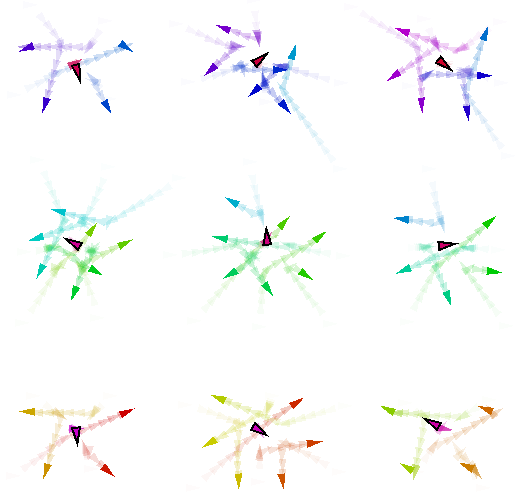

+++
pre = ""
title = "2023: MacroSwarm - A Field-based Compositional Framework for Swarm Programming"
weight = 5
summary = "Simulations demonstrating MacroSwarm, a field-based library for expressing swarm behaviors in a declarative way, presented at COORDINATION 2023."
tags = ["simulation", "swarm", "aggregate computing", "scafi", "drones", "macroswarm"]
hidden = true
+++

From 

Simulation publicly available at [https://github.com/AggregateComputing/experiment-2023-coordination-swarm-behaviour](https://github.com/AggregateComputing/experiment-2023-coordination-swarm-behaviour)

## Abstract

Programming swarm behaviors is a challenging task due to the complexity of coordinating multiple autonomous agents
in a distributed and dynamic environment.
Traditional approaches often require low-level imperative programming,
making it difficult to express and maintain complex collective behaviors.

MacroSwarm is a field-based library for expressing swarm behaviors in a declarative and compositional way.
It is built on top of the Aggregate Computing framework,
a distributed computing paradigm for the JVM that enables the specification of collective behaviors
through spatial computations over fields of values.
MacroSwarm is specifically implemented on top of ScaFi,
a Scala-based library for programming aggregate computing systems.
The library provides high-level abstractions that simplify the development of swarm coordination patterns,
such as formation control, flocking, and cooperative task allocation.

The following simulations are built on top of Alchemist,
a flexible meta-simulator for pervasive and aggregate computing systems.

## Simulation description

The experiment presents a case study highlighting MacroSwarm's ability to express complex swarm behaviors
through a compositional and declarative API.

In the proposed scenario,
a fleet of drones is deployed to patrol a spatial area of $1 \text{ km}^2$.
Within this environment,
dangerous situations may arise randomly,
such as fires breaking out or people getting injured.
When such emergencies occur,
specialized drones designated as _healers_ must approach the danger zone and resolve the situation.

The exploration strategy requires coordination in heterogeneous groups,
each composed of at least one healer and several explorer drones.
The explorers assist healers in identifying alarm situations across the patrolled area.
The simulation begins with 50 explorer drones and 5 healer drones randomly positioned within the area.

Each drone operates with the following constraints:
- Maximum speed of approximately $20 \text{ km/h}$ ($\sim 5.5 \text{ m/s}$)
- Communication range of $100 \text{ m}$

Alarm situations are generated randomly at different times within a $[0, 50]$-minute (simulated) timeframe.
Each simulation run lasts 90 simulated minutes,
during which the swarm coordination mechanisms are evaluated based on their effectiveness
in detecting and resolving emergencies while maintaining efficient area coverage.

## Snapshots
The following images show different phases of the swarm coordination behavior during the simulation.

## Additional Resources

For more information about the MacroSwarm framework and its capabilities,
please refer to the [MacroSwarm website](https://scafi.github.io/macro-swarm/guide/alchemist.html).

## Citation

