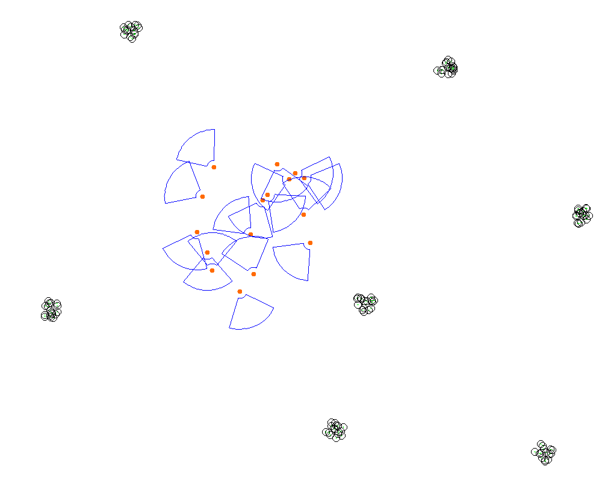
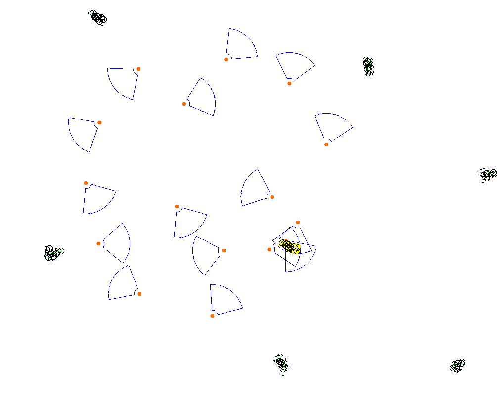
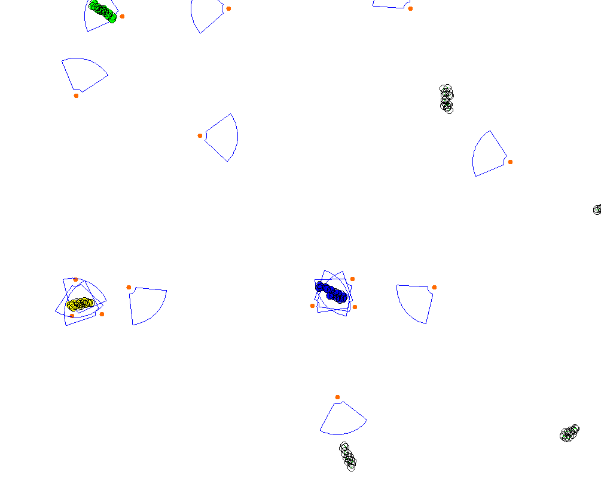

+++
pre = ""
title = "2024: Decentralized Multi-Drone Coordination for Wildlife Video Acquisition"
weight = 5
summary = "Simulation of decentralized multi-drone coordination for wildlife video acquisition."
tags = ["simulation", "imageonomics", "drones", "protelis"]
hidden = true
+++

Simulation publicly available at: [https://github.com/nicolasfara/experiments-2024-ACSOS-imageonomics-drones](https://github.com/nicolasfara/experiments-2024-ACSOS-imageonomics-drones)

## Abstract

One of the best sources of information for biologists and ethologists to study wildlife behavior is video footage;
in particular, aerial video footage provides a unique perspective on the behavior of animals in their natural habitat.
Numerous wildlife behavioral studies have demonstrated the effectiveness of UAVs for collecting video data of group-living animals.
However, in contrast with well-established techniques for static video acquisition, the deployment of UAVs for wildlife video acquisition
requires human operators to manually control and coordinate the drones while minimizing disturbance to animals.
To scale UAVs missions to obtain sufficient spatiotemporal resolution, reliance on manual operations is impractical.
In this paper, we present a decentralized multi-drone coordination system for wildlife video acquisition using UAVs that leverages a novel k-coverage
algorithm specifically designed to cover herds. In particular, it is based on a hierarchical clustering approach to find the herds'
centroids, then it coordinates multiple drones in a decentralized fashion to cover them from multiple points of view.
We introduce a set of metrics to evaluate the effectiveness of the proposed approach via simulation,
finding that the proposed approach improves noticeably over the present state of the art.

## Simulation description

We evaluate our decentralized multi-drone
coordination system for wildlife video acquisition via simulation, comparing it to the current state of the art in the OMOkC
problem considering both the quality of the footage and the
noise pollution generated by the drones.

We chose zebras as target animals, as they are group-living animals known to form herds.
Zebras are a common target for wildlife monitoring, and
their behavior is well-documented, including recent drone studies.

We place UAVs close together in a circular zone with a 200m radius,
simulating the mission as starting from a random location in the operation area.
The UAVs have a communication range of 1km and move at a maximum speed of $10 \frac{m}{s}$.
Their FoV is parametrized with $R = 100m$, $B = 18m$, $\beta = 80°$; these values were selected to match those of a
[commercially available quadcopter](https://archive.is/hVoJw).

Periodically, with a frequency of 1Hz, the drones execute a
loop of the tracking algorithm to select their target. We compared four tracking algorithms:
  - `sm_av`: selects the target closest to the drone;
  - `ff_lin_pro`: the current best-performing algorithm for distributed OMOkC, which builds and solves a local optimization problem to attribute targets to UAVs;
  - `bc_re_c`: an extension to the original bc_re algorithm that selects the targets with the worst coverage, equipped with the clustering mechanisms to work on cluster centroids instead;
  - `ff_lin_pro_c`: a variant of `ff_lin_pro` algorithm that includes clustering.

We investigate a single video acquisition session with the drones operating for 30 simulated minutes.

The performance of various algorithms for wildlife tracking is analyzed, highlighting their effectiveness in different scenarios.
The original `ff_lin_pro` algorithm, known for its success in classic OMOkC scenarios, performs poorly in wildlife tracking.
However, when adapted with a problem-specific clustering system (`ff_lin_pro_c`), it outperforms all other algorithms.
Detailed results show that while `ff_lin_pro` achieves better field-of-view (FoV) distance by focusing on tracked animals,
it compromises overall coverage.

With herd knowledge added, FoV distance worsens due to a broader inclusion of animals in the scene.
The proposed `ff_lin_pro_c` approach scales well with the number of cameras and performs best for 1- and 3-coverage with sufficient UAVs.
Despite higher noise levels from closer UAV positioning, the noise remains within acceptable limits for wildlife monitoring.

## Snapshots

