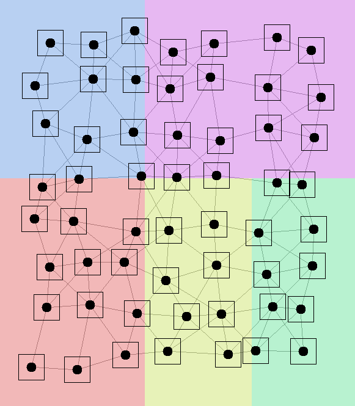
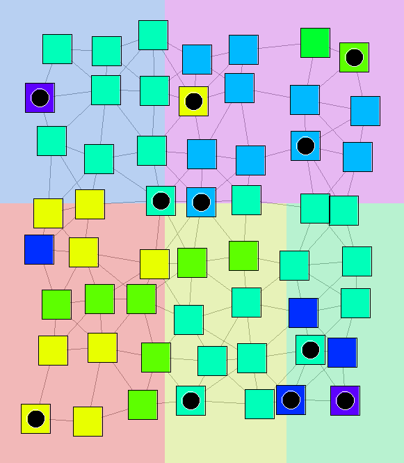
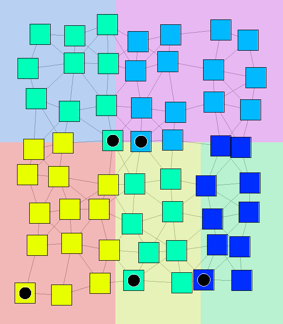
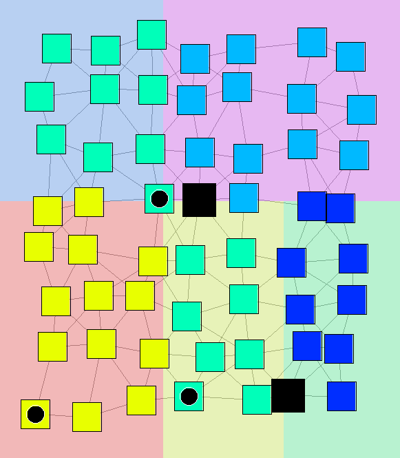
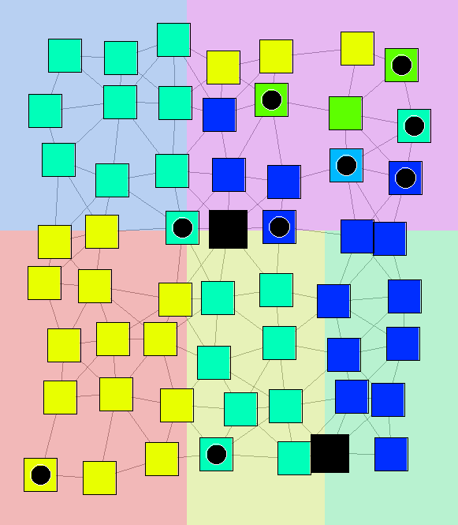
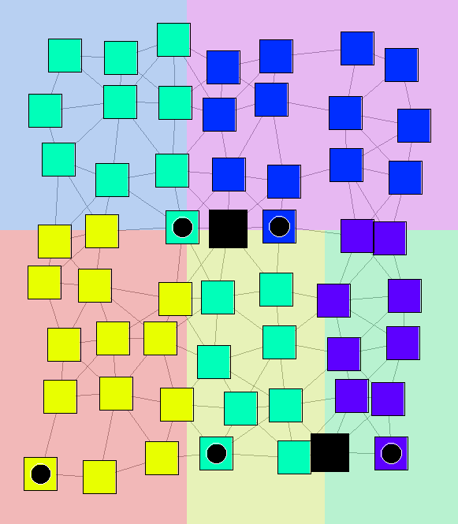

+++
pre = ""
title = "Federated Learning for Large Scale Distributed Systems"
weight = 6
summary = "Simulations related ScaRLib tool for Science of Computer Programming journal (2024)."
tags = ["simulation", "aggregate computing", "multi-agent reinforcement learning"]
hidden = true
+++

[//]: # (From )

[//]: # ()

Simulation and detailed description publicly available at:
- [https://github.com/domm99/experiments-2025-lmcs-field-based-FL](https://github.com/domm99/experiments-2025-lmcs-field-based-FL) .

- [https://github.com/domm99/experiments-2025-iot-self-federated-learning](https://github.com/domm99/experiments-2025-iot-self-federated-learning) .

Related to the papers:

-  ``_Field-Based Coordination for Federated Learning_ '' published at _International Conference on Coordination Models and Languages_ (DOI: [10.1007/978-3-031-62697-5_4](https://doi.org/10.1007/978-3-031-62697-5_4)).

-  ``_Proximity-based Self-Federated Learning_ '' published at _International Conference on Autonomic Computing and Self-Organizing Systems_ (DOI: [10.1109/ACSOS61780.2024.00033](https://doi.org/10.1109/ACSOS61780.2024.00033)).

-  ``_FBFL: A Field-Based Coordination Approach for Data Heterogeneity in Federated Learning_ '' submitted at Journal _Logical Methods in Computer Science_ (DOI: [arXiv.2502.08577](https://doi.org/10.48550/arXiv.2502.08577)).

- ``_Decentralized Proximity-Aware Clustering for Collective Self-Federated Learning_ '' submitted at Journal _Internet of Things_.

## Abstract 
In the era of pervasive devices and edge intelligence, Federated Learning enables multiple distributed nodes to collaboratively train machine learning models without exchanging raw data. This fosters privacy preservation and bandwidth efficiency. Yet, real-world deployments face challenges of data heterogeneity, network dynamics, and lack of centralized control.

In our work, we harness the Alchemist simulator as a playground for exploring field-based, self-organizing, and spatial coordination paradigms for federated learning. Through three complementary simulation experiments, we investigate how devices can autonomously organize, aggregate, and adapt models in a fully decentralized manner, leveraging computational fields and spatial interaction patterns.

## Simulations 

### 1. Field-Based Federated Learning (FBFL)

This simulation explores the emergence of personalized model zones using computational fields as a distributed coordination mechanism.
Devices in spatial proximity exchange model parameters through local diffusion processes, forming hierarchical regions governed by dynamically elected leaders. These leaders act as aggregators for their respective zones, enabling localized learning and self-stabilizing coordination.

#### Methodology & Implementation  
- **Distributed spatial leader election**: nodes autonomously select aggregators within neighborhoods  
- **Hierarchical aggregation**: aggregation occurs at multiple levels based on spatial zones  
- **Field coordination primitives**: implemented via ScaFi over Alchemist, using constructs like diffusion, convergence, and feedback loops  
- **Datasets used**: MNIST, FashionMNIST, Extended MNIST  
- **Simulation parameters**: (qui puoi inserire il numero di nodi, il raggio di comunicazione, numero di round, etc.)

#### Key Outcomes  
- Accuracy under IID settings comparable to centralized FedAvg  
- Superior robustness to node failures and topology changes  
- Emergent spatial clusters aligned to local data distributions  
- No reliance on any central server 

### Proximity-based Self-Federated Learning
This experiment introduces a collective intelligence paradigm for federated IoT systems.
Devices autonomously cluster into self-federations based on both spatial proximity and model similarity, forming specialized local models that better represent underlying regional data distributions.

- **Goal**: Enable adaptive, decentralized FL in non-IID IoT environments.

- **Method**: Field-based coordination using Self-Organizing Coordination Regions (SCR) and space-fluid sparse choice for dynamic federation formation.

- **Implementation**: Each node locally computes similarity with neighbors, elects a regional leader, and participates in decentralized aggregation cycles.

- **Dataset**: Extended MNIST and CIFAR-100.

## Federation evolution under aggregator failure

  

    
    
Start of the learning.

  

  

    
    
Federations stabilization.

  

  

    
    
Learning.

  

  

    
    
Aggregators failure.

  

  

    
    
Federations re-stabilization.

  

  

    
    
Learning.

  

