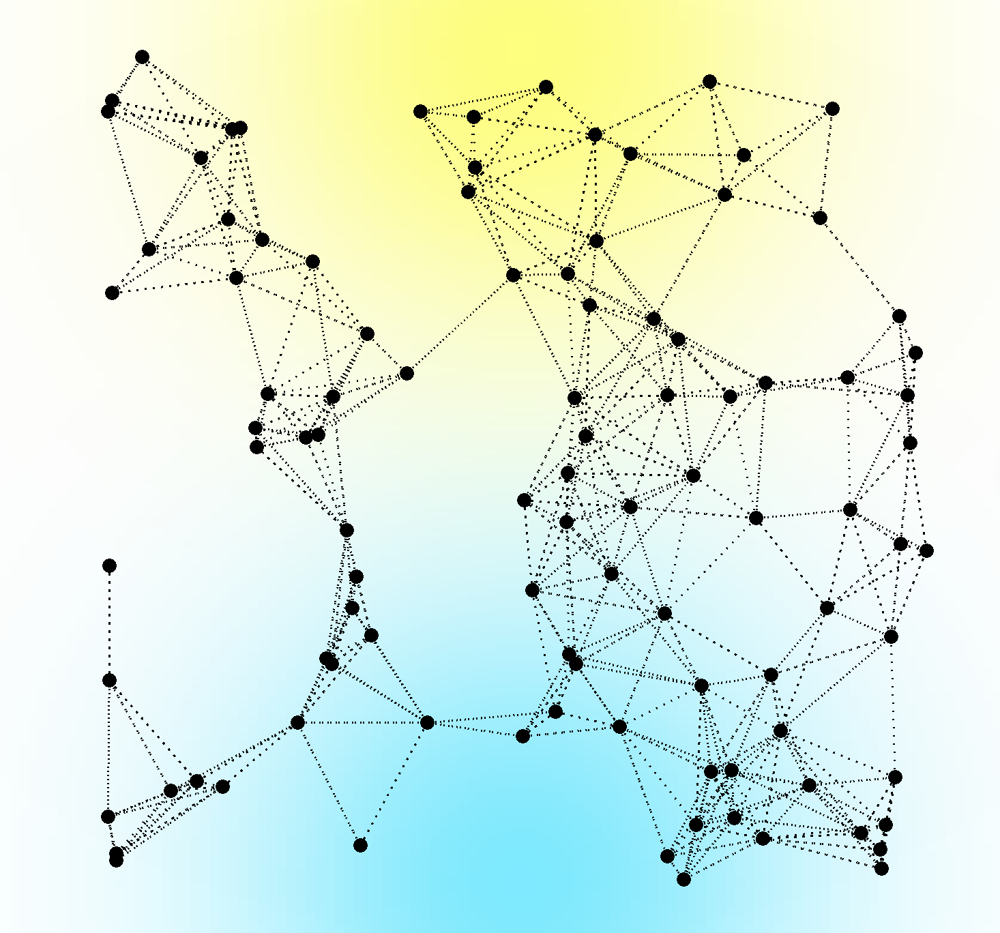
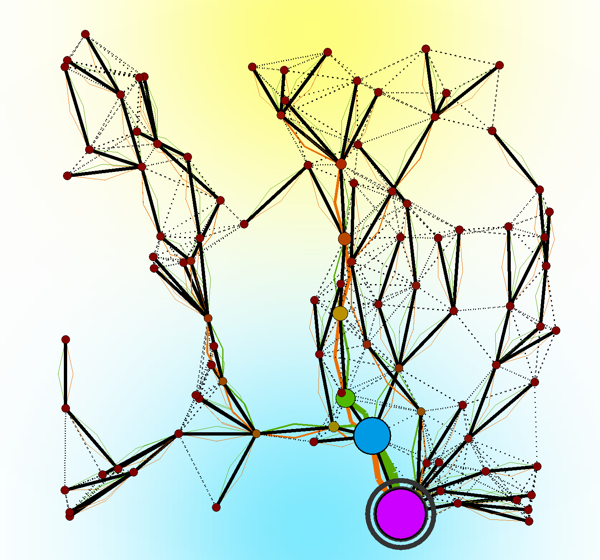
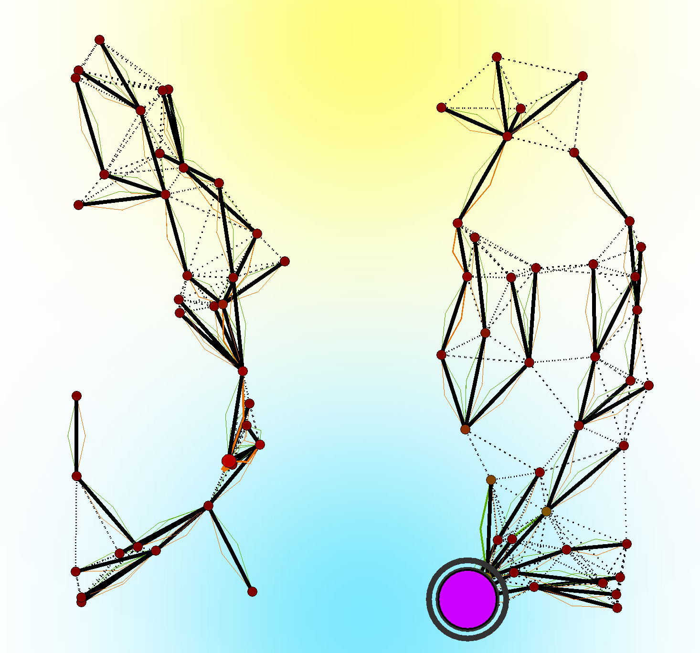
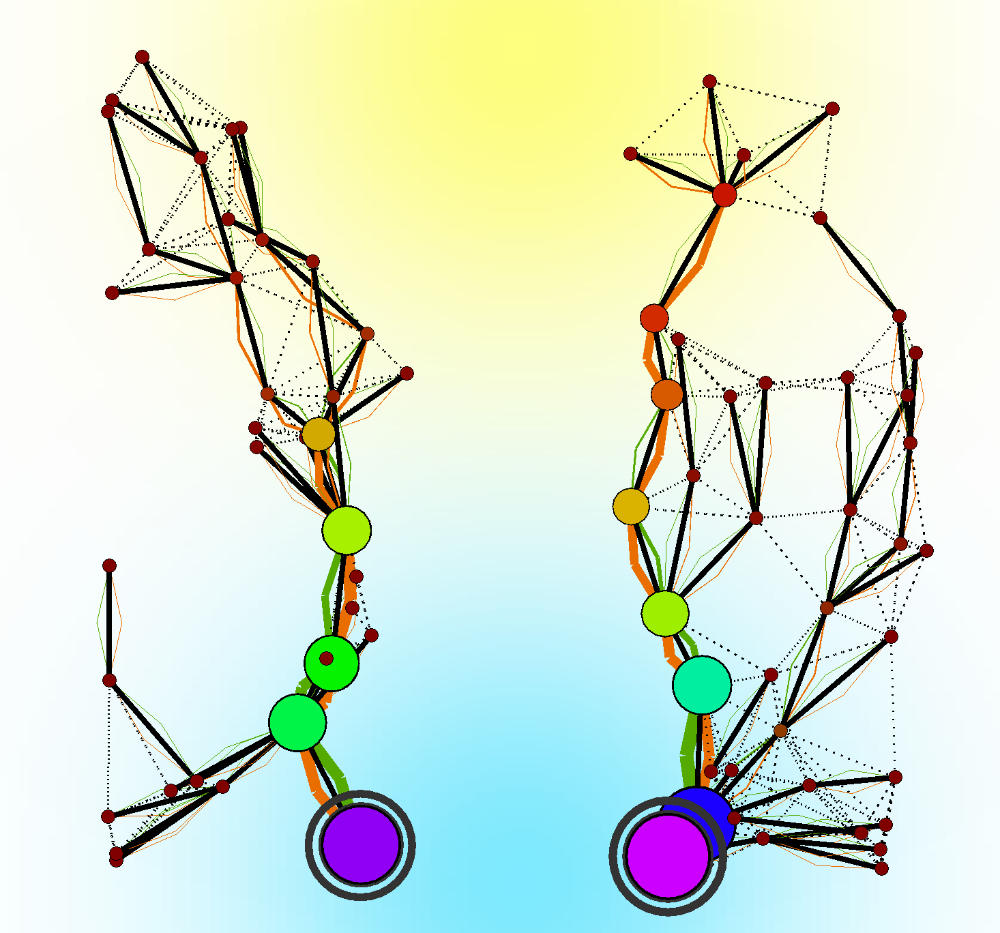
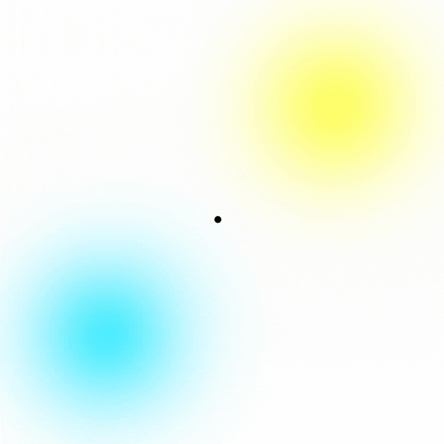

+++
pre = ""
title = "2024: Aggregate Vascular Morphogenesis Controller"
weight = 5
summary = "Simulations related to the generalization of the Vascular Morphogenesis algorithm using the Aggregate Computing paradigm, presented at ACSOS 2024."
tags = ["simulation", "aggregate computing", "vascular morphogenesis"]
hidden = true
+++

[//]: # (From )

[//]: # ()

Simulation and detailed description publicly available at [https://github.com/angelacorte/vmc-experiments](https://github.com/angelacorte/vmc-experiments),
related to the paper ``_An Aggregate Vascular Morphogenesis Controller for Engineered Self-Organising Spatial Structures_'' presented at ACSOS 2024 (DOI available soon).

## Abstract
In the field of evolutionary computing, the concept of Vascular Morphogenesis Controller (VMC) has been proposed in to model the growth of artificial structures over time.

A thorough analysis of the VMC model revealed some limitations:
- assumes the organization structure is a tree, 
  here intended as a directed acyclic graph with a single root and with a single path connecting the root with each leaf;
- the model is implicitly synchronous, as it assumes that (i) the evaluation of the nodes must proceed from the leaves to the root (and back),
  and (ii) the update of the whole tree occurs atomically.

Although, 
depending on the context, 
these assumptions may be acceptable, 
in general they may induce (possibly hidden) abstraction gaps when VMC is used to model real-world systems, and, at the same time, 
limit the applicability of the pattern to engineered morphogenetic systems.

To address these limitations, in this work, we propose FieldVMC: 
a generalisation of the VMC model as a field-based computation, in the spirit of the Aggregate Programming (AP) paradigm.

## Experiment description
The experiments want to show the capabilities of the proposed model in generating self-organising spatial structures.

The goal of this evaluation is to show that the proposed FieldVMC supports the construction of the same structures of its predecessor, 
and, in addition, that it can work in scenarios not previously investigated. 
To this end, we designed a set of five experiments:
- _oneRoot_: self-construction from a single node (growth from seed),
- _cutting_: self-repair after disruption (network segmentation) with no regeneration (cutting). The segmentation is performed by removing a part of the structure after 500 simulated seconds, and the nodes are not able to regenerate the missing part;
- _graft_: self-integration of multiple FieldVMC systems (grafting). Two distinct structures are created, and after 500 simulated seconds, they are merged into a single structure;
- _graftWithMoreLeaders_: self-segmentation of a larger structure (budding). Two distinct structures are created with possibly more than leader each; after 500 simulated seconds, they are merged into a single structure;
- _graftWithSpawning_: self-optimization of multiple large structures into a more efficient one (abscission and regrowth). Two distinct structures are created, and after 500 simulated seconds, they are merged into a single structure. During the simulation, nodes are able to spawn new nodes and destroy the ones that are not useful anymore, resulting in an optimized structure.

## Results
In all the experiments, the cyan area represents the resource and the yellow area is the success, with darker shades indicating higher values. \
Nodes are represented as circles.
The root is identified by a dark outer circumference.\
The size of a circle depends on the amount of resource and success received
relative to all other nodes in the system: we fix the maximum possible size $D$, we compute the maximum amount of resource $R$
and the maximum amount of success $S$ across all nodes in the system;
then, for each node in the system with success $s$ and resource $r$,
we determine its size $d$ proportionally to $D$ as $d=\frac{D (r + s)}{R + S}$. \
Their color depends on the amount of resource nodes have and is assigned based on the hue of the HSV color space,
with the most resource associated with indigo, and the lowest with red.\
Dashed lines are communication channels, solid black lines represent the tree structure, and green (resp. orange) lines depict
the resource (resp. success) distribution flows, the thicker they are, the more resource (resp. success) is being transferred.

Some examples of the generated structures are shown below:

|       |                |
|:--------------------------------------------------:|:-----------------------------------------------------------------:|
|                *Starting Structure*                |                    *Self-Organised Structure*                     |
|  |  |
|       *Structure after cutting a part of it*       |           *Self-Organised Structure after the cutting*            | 

The images show the evolution of a structure from a starting configuration to a self-organized structure,
after a part of the structure has been removed.

As seen in the sequence below,
the structure evolves from a single node to a more complex structure.
Firstly, the structure results to expand towards the center of the available resources.
This happens because the spawned nodes are in a zone with higher resources,
used as weight in the leader election phase,
thus the newly created node gets elected as the new leader,
which results in an expansion towards the center of the resource layer.
While the root gains more resources,
nodes will spawn children based on their local success,
meaning that the nodes which sense more success from the environment have higher probability and capabilities to spawn new children,
resulting in an expansion towards the center of the success layer.
The structure then stabilizes in what appears to be the optimal configuration,
and the structure stops evolving.

<figure>
  
  <figcaption>Sequence of images showing the evolution in time of the structure in the <i>oneRoot</i> experiment.</figcaption>
</figure>

