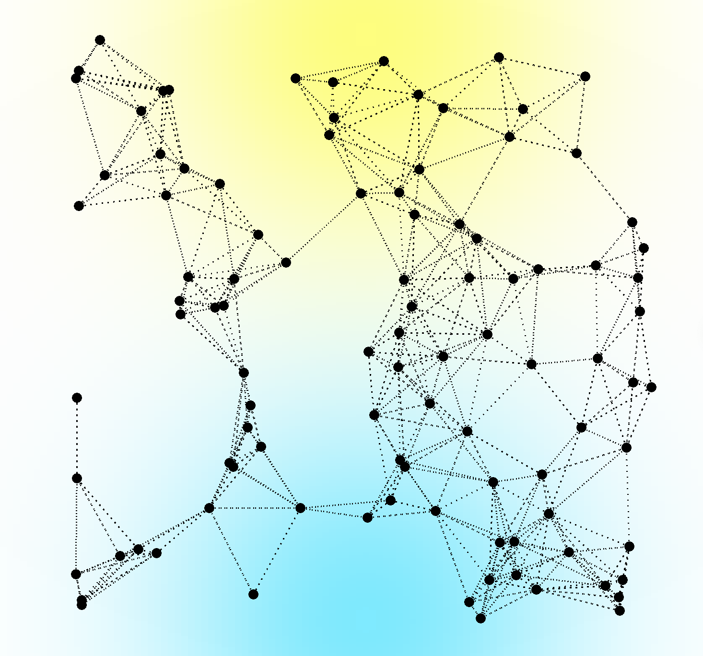
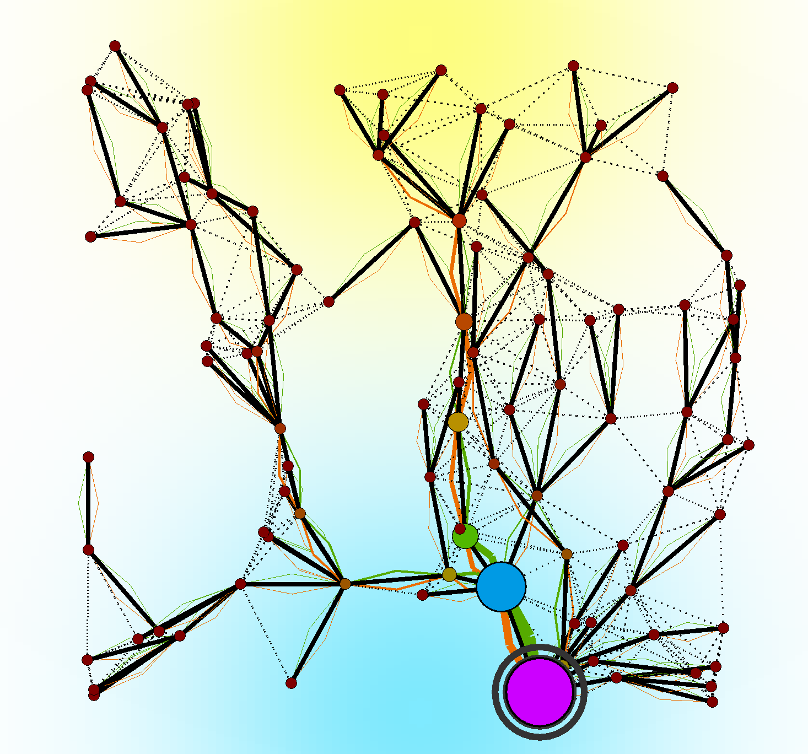
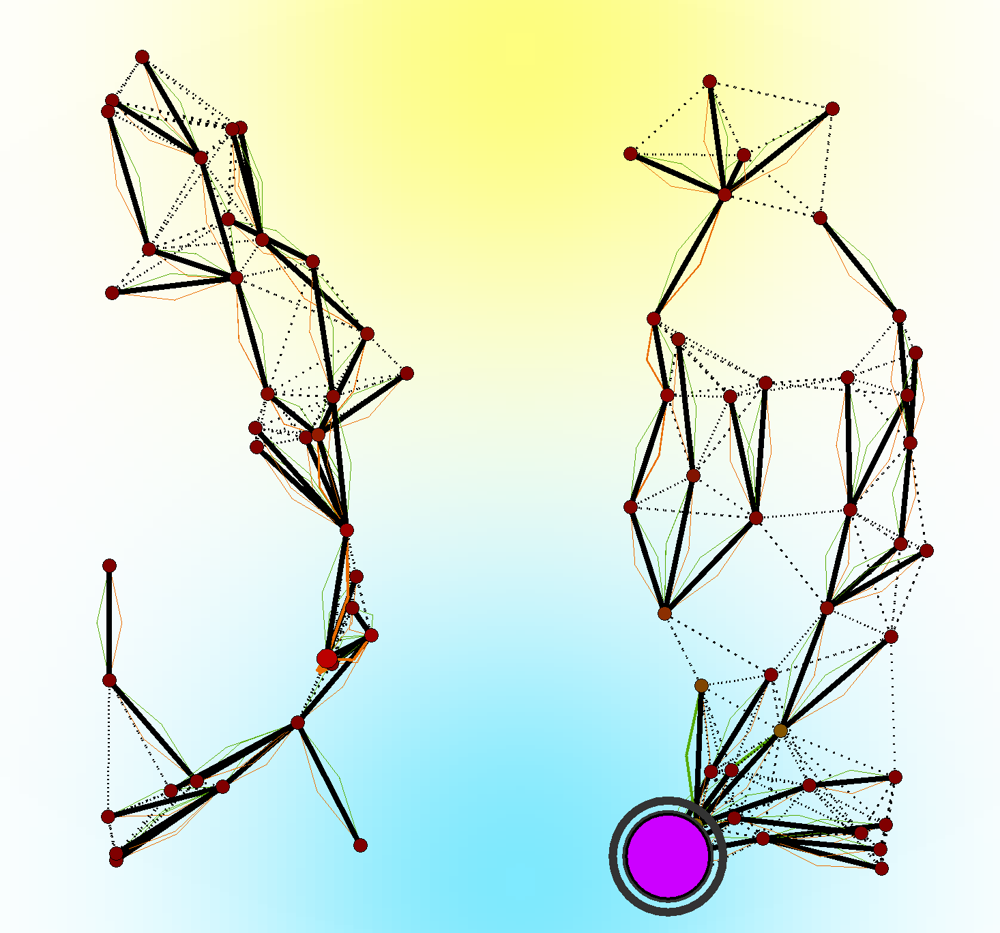
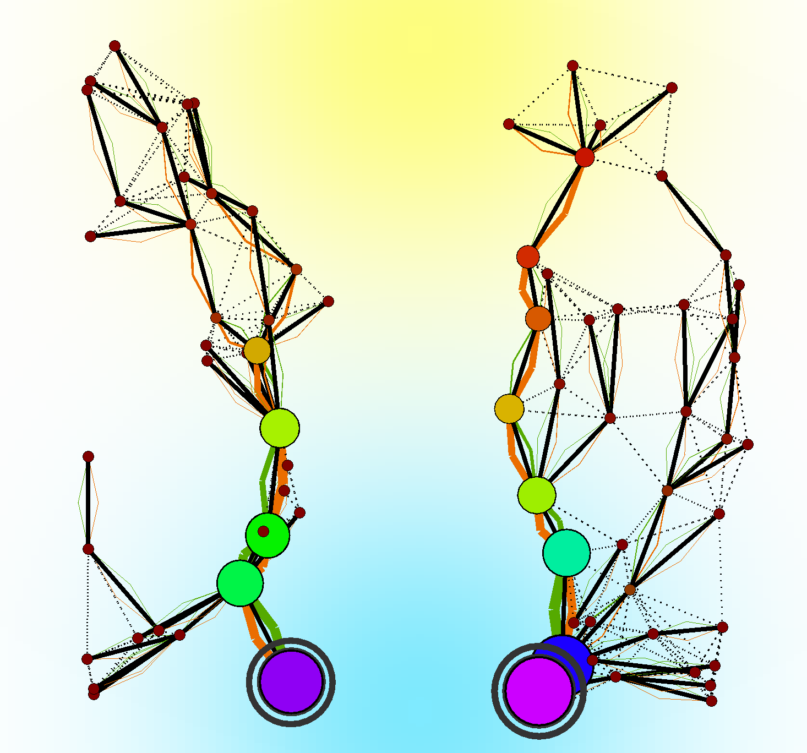
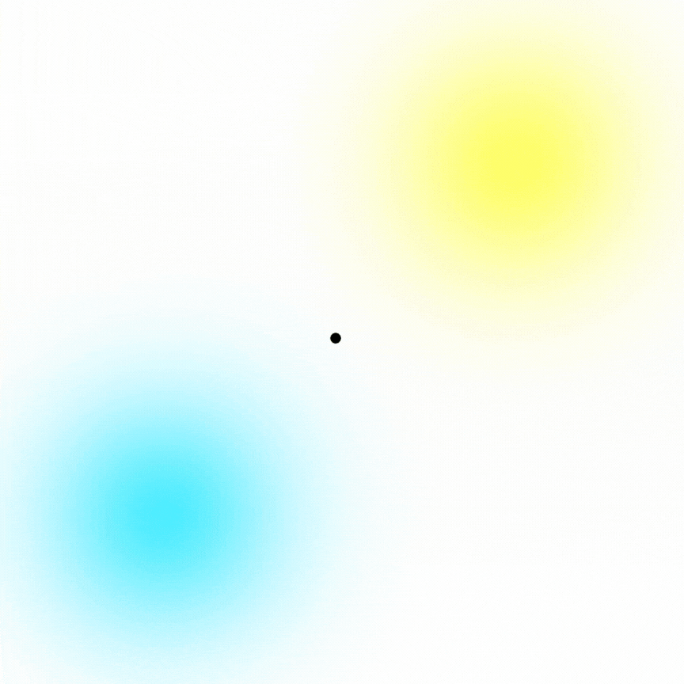

+++
pre = ""
title = "2025: FieldVMC: An Asynchronous Model and Platform for Self-Organising Morphogenesis of Artificial Structures"
weight = 5
summary = "Simulations related to the generalization of the Vascular Morphogenesis algorithm using the Aggregate Computing paradigm, presented at ACSOS 2024."
tags = ["simulation", "aggregate computing", "vascular morphogenesis"]
hidden = true
+++

**Experimental Information** Experimental artefact and simulation setup available at  
[https://github.com/angelacorte/fieldVMC](https://github.com/angelacorte/fieldVMC)  

This artefact originates from the preliminary work  
*“An Aggregate Vascular Morphogenesis Controller for Engineered Self-Organising Spatial Structures”* presented at **ACSOS 2024** (DOI: [10.1109/ACSOS61780.2024.00032](https://doi.org/10.1109/ACSOS61780.2024.00032)).

The approach has subsequently been extended and formalised in the journal article  
*“FieldVMC: an asynchronous model and platform for self-organising morphogenesis of artificial structures”*,  
published in **Complex & Intelligent Systems (2026)** (DOI: [10.1007/s40747-025-02141-y](https://doi.org/10.1007/s40747-025-02141-y)).

**Technical Note** This experiment uses an old Collektive version: `13.1.1`.

## Abstract
In the field of evolutionary computing, the concept of Vascular Morphogenesis Controller (VMC) has been proposed in to model the growth of artificial structures over time.

A thorough analysis of the VMC model revealed some limitations:
- assumes the organization structure is a tree, here intended as a directed acyclic graph with a single root and with a single path connecting the root with each leaf;
- the model is implicitly synchronous, as it assumes that (i) the evaluation of the nodes must proceed from the leaves to the root (and back), and (ii) the update of the whole tree occurs atomically.

Although, depending on the context, these assumptions may be acceptable, in general they may induce (possibly hidden) 
abstraction gaps when VMC is used to model real-world systems, and, at the same time, 
limit the applicability of the pattern to engineered morphogenetic systems.

To address these limitations, in this work, we propose FieldVMC: 
a generalisation of the VMC model as a field-based computation, in the spirit of the Aggregate Programming (AP) paradigm.

More specifically, FieldVMC reinterprets the VMC dynamics as an **aggregate field computation**, 
enabling decentralised and asynchronous execution over arbitrary network topologies (i.e., undirected graphs rather than trees). 
Under this formulation, the hierarchical structures typical of VMC emerge from local self-organising interactions among nodes
rather than from an explicitly maintained tree structure.

Subsequent work formally proves that FieldVMC is a **monotonic extension of the original VMC model**, 
meaning that it can reproduce the behaviours of VMC while enabling additional phenomena such as structure merging, splitting,
and optimisation, and that the resulting system is **self-stabilising under eventual quiescence**.

## Experiment description
The experiments want to show the capabilities of the proposed model in generating self-organising spatial structures.
The goal of this evaluation is to show that the proposed FieldVMC supports the construction of the same structures of its predecessor,
and, in addition, that it can work in scenarios not previously investigated.
In the extended journal evaluation, experiments are organised into three classes:
- **Type A**: comparison between VMC and FieldVMC (e.g., self-construction and self-healing),
- **Type B**: analysis of new phenomena enabled by FieldVMC (self-integration, self-division, self-optimisation),
- **Type C**: scalability analysis focusing on communication costs and data rates.

The experiments presented in this artefact correspond to scenarios exploring the emergent behaviours enabled by the aggregate formulation.
To this end, we designed a set of experiments:
- _legacySelfConstruction_: self-construction from a single node (growth from seed),
- _selfDivision_: self-division after disruption (network segmentation) with no regeneration (cutting). The segmentation is performed by removing a part of the structure after 500 simulated seconds, and the nodes are not able to regenerate the missing part;
- _selfIntegration_: self-integration of multiple FieldVMC systems (grafting). Two distinct structures are created, and after 500 simulated seconds, they are merged into a single structure;
- _selfSegmentation_: self-segmentation of a larger structure (budding). Two distinct structures are created with possibly more than leader each; after 500 simulated seconds, they are merged into a single structure;
- _selfOptimisation_: self-optimisation of multiple large structures into a more efficient one (abscission and regrowth). Sparse nodes are created far from success and resource sources, with spawning and destruction of nodes enabled, the structure is allowed to grow and optimize itself.
- _selfConstructionClassicVMC_: implementation of the classic VMC model, starting from a single node, with spawning of new nodes but no destruction of them;
- _selfHealingClassicVMC_: same of the previous one, but with the cutting of a part of the structure after 500 simulated seconds;
- _selfConstructionFieldVMC_: implementation of our FieldVMC model, with optimized parameters to be as close as possible to the classic VMC model;
- _selfHealingFieldVMC_: same of the previous one, but with the cutting of a part of the structure after 500 simulated seconds;
- _selfConstructionFieldVMCOptimizer_: launcher of our FieldVMC model in order to evaluate the optimized parameters used in the comparison with the classic VMC model.

More generally, these scenarios illustrate how the aggregate formulation allows the system to naturally support structural operations such as **growth, merging, division, and reconfiguration**, which are difficult to express in the original VMC formulation.

## Results
In all the experiments, the cyan area represents the resource and the yellow area is the success, with darker shades indicating higher values. 
Nodes are represented as circles. The root is identified by a dark outer circumference.
The size of a circle depends on the amount of resource and success received relative to all other nodes in the system: we fix the maximum possible size **_D_**, 
compute the maximum amount of resource **_R_** and the maximum amount of success **_S_** across all nodes in the system. 
Then, for each node in the system with success **_s_** and resource **_r_**, we determine its size **_d_** proportionally to **_D_** as: **_`d = D × (r + s)/(R + S)`_**

Their color depends on the amount of resource nodes have and is assigned based on the hue of the HSV color space, with the most resource associated with indigo, and the lowest with red.
Dashed lines are communication channels, solid black lines represent the tree structure, and green (resp. orange) lines depict the resource (resp. success) distribution flows, the thicker they are, the more resource (resp. success) is being transferred.

Some examples of the generated structures are shown below:

|                         |                  |
|:--------------------------------------:|:--------------------------------------------:|
|          *Starting Structure*          |          *Self-Organised Structure*          |
|  |                   |
| *Structure after cutting a part of it* | *Self-Organised Structure after the cutting* |

The images show the evolution of a structure from a starting configuration to a self-organized structure, after a part of the structure has been removed.

As seen in the sequence below, the structure evolves from a single node to a more complex structure. 
Firstly, the structure results to expand towards the center of the available resources. 
This happens because the spawned nodes are in a zone with higher resources, used as weight in the leader election phase,
thus the newly created node gets elected as the new leader, which results in an expansion towards the center of the resource layer. 
While the root gains more resources, nodes will spawn children based on their local success, 
meaning that the nodes which sense more success from the environment have higher probability and capabilities to spawn new children, 
resulting in an expansion towards the center of the success layer. 
The structure then stabilizes in what appears to be the optimal configuration, and the structure stops evolving.

<figure>
  
  <figcaption>Sequence of images showing the evolution in time of the structure in the <i>oneRoot</i> experiment.</figcaption>
</figure>

