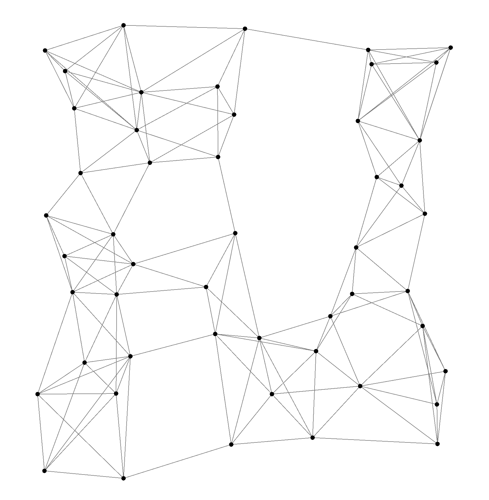
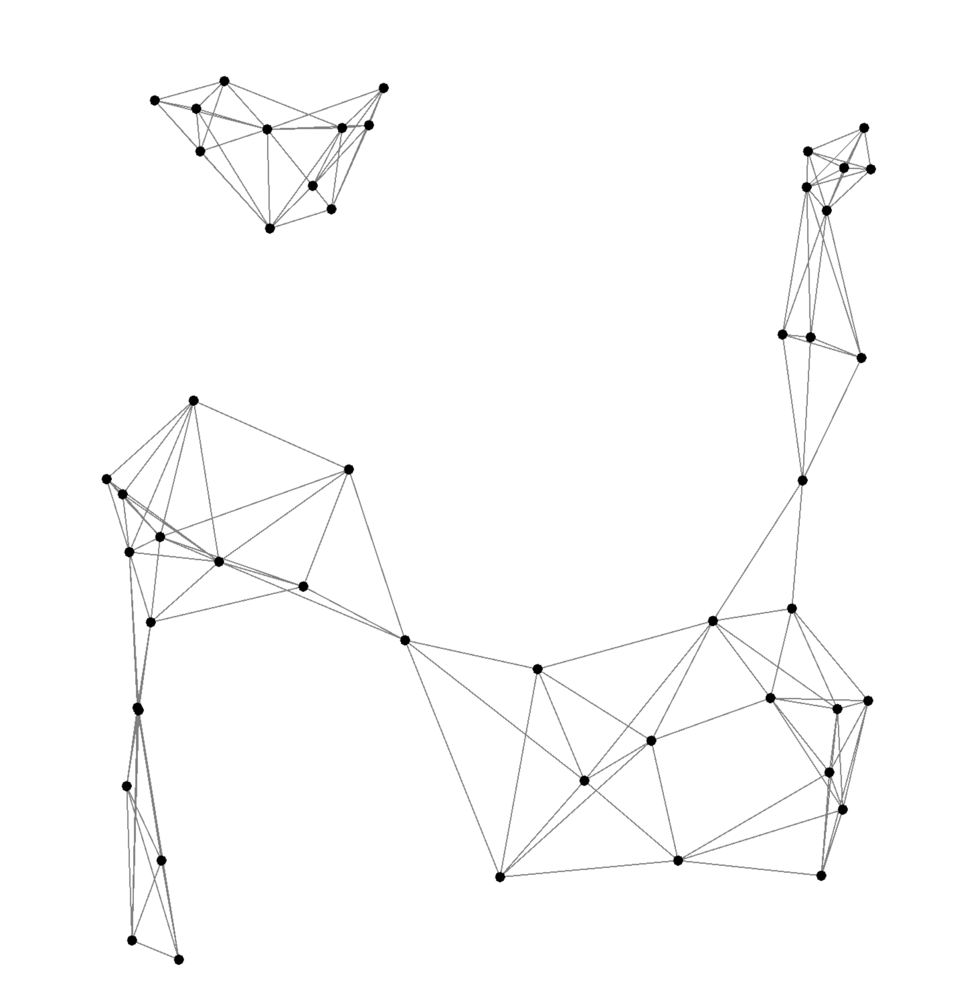
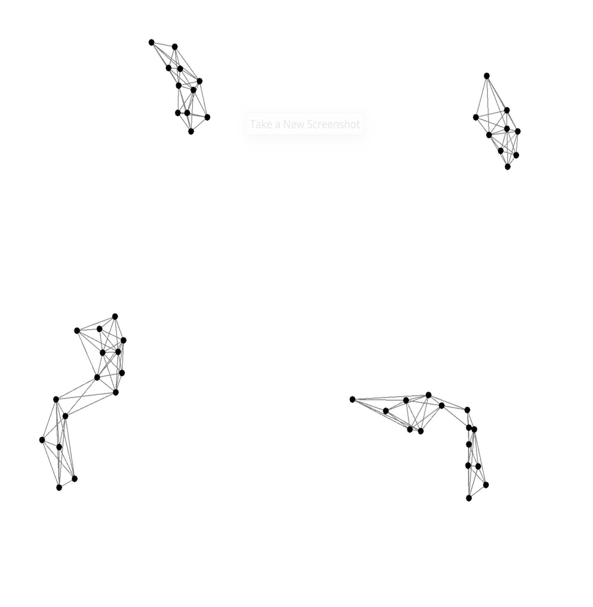
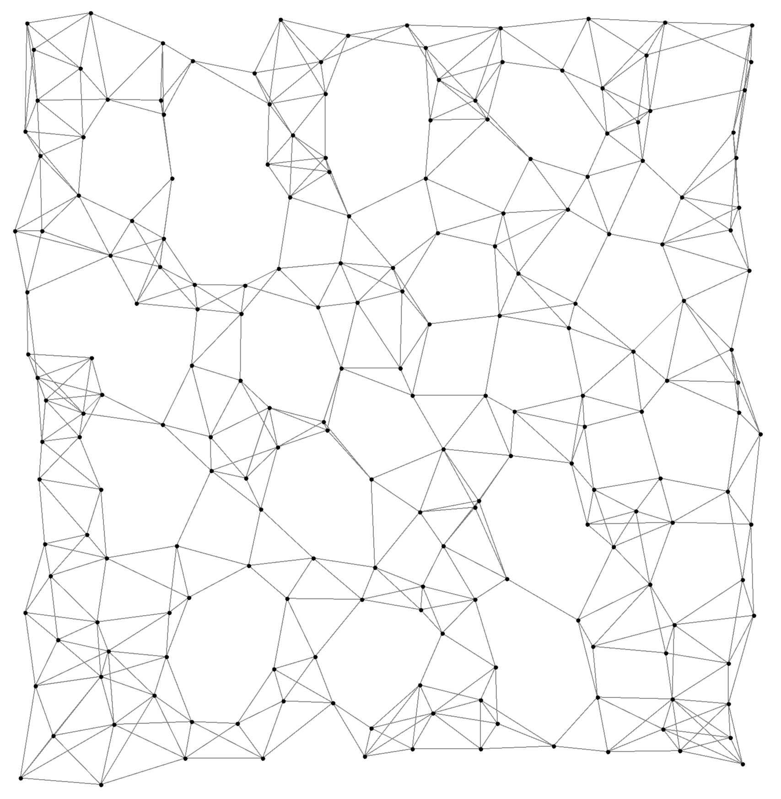
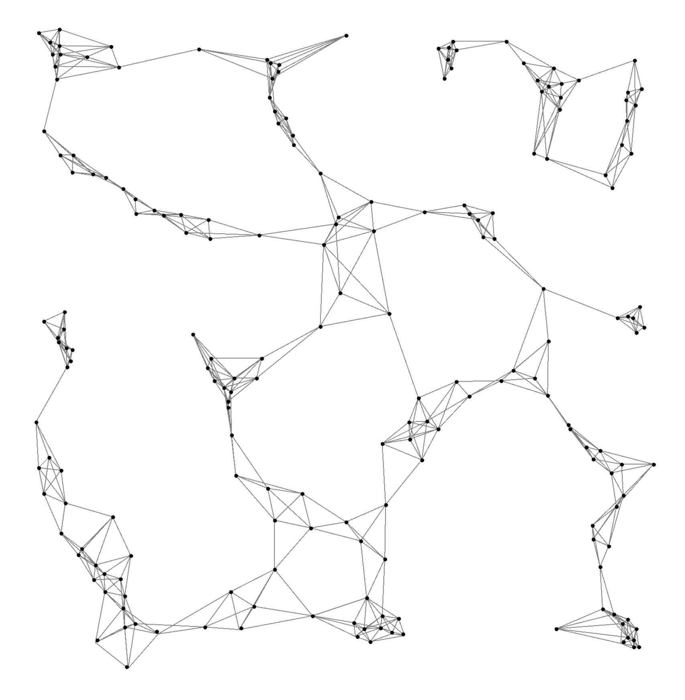
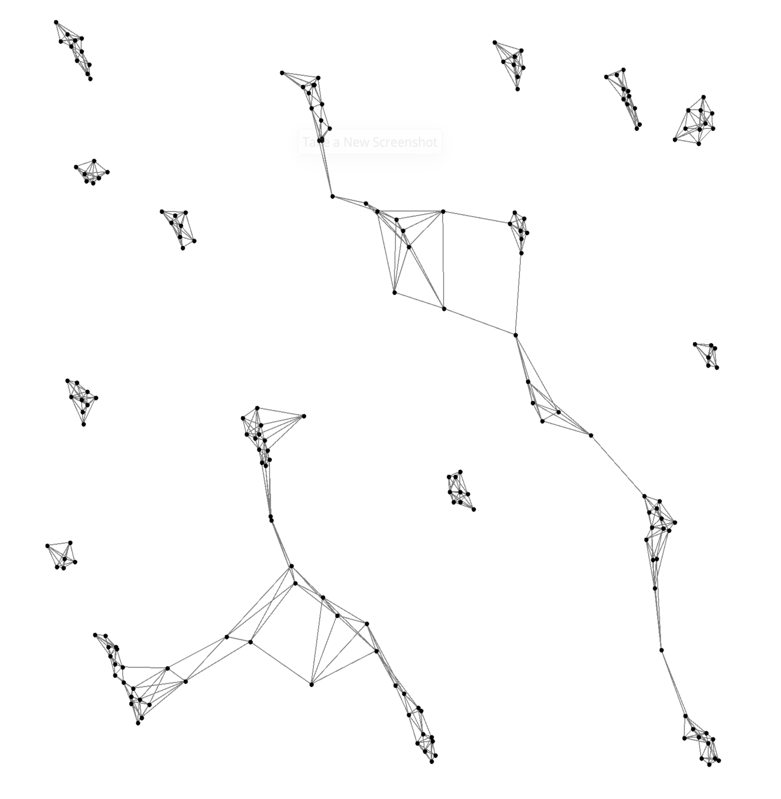

+++
pre = ""
title = "2024: ScaRLib: Towards a hybrid toolchain for aggregate computing and many-agent reinforcement learning"
weight = 6
summary = "Simulations related ScaRLib tool for Science of Computer Programming journal (2024)."
tags = ["simulation", "aggregate computing", "multi-agent reinforcement learning"]
hidden = true
+++

[//]: # (From )

[//]: # ()

Simulation and detailed description publicly available at [https://github.com/ScaRLib-group/SCP-ScaRLib-flock-demo](https://github.com/ScaRLib-group/SCP-ScaRLib-flock-demo) .
Related to the paper ``_ScaRLib: Towards a hybrid toolchain for aggregate computing and many-agent reinforcement learning_'' published in the journal _Science of Computer Programming_ (DOI: [10.1016/j.scico.2024.103176](https://doi.org/10.1016/j.scico.2024.103176)).

## Abstract

ScaRLib is a Scala-based framework designed to merge macroprogramming and multi-agent reinforcement learning (MARL) 
 in large-scale cyber-physical systems.
It integrates Alchemist, ScaFi, and PyTorch into a modular toolchain that allows developers 
 to define and train swarm behaviors through high-level abstractions and declarative configurations.

In essence, ScaRLib makes it possible to teach simulated agents collective behaviors 
 — such as coordination, cohesion, and collision avoidance — 
 by combining aggregate computing models with deep reinforcement learning techniques.
This hybrid approach paves the way for adaptive, scalable, and self-organizing swarm systems.

## Experiment description

### Objective

This experiment demonstrates how reinforcement learning can be combined with aggregate computing to produce flocking behavior — where agents (e.g., drones) learn to maintain cohesion while avoiding collisions.

### Setup

Agents are deployed in a $2D$ continuous environment simulated by Alchemist, each capable of moving in eight directions (N, S, E, W, and diagonals).
Each agent perceives only its local neighborhood (the five nearest agents) and decides its next move based on its learned policy.

The ScaFi aggregate program defines how agents perceive their surroundings — computing distances to neighbors and building their state representation.
Learning is managed through the Centralized Training, Decentralized Execution (CTDE) model in ScaRLib, where agents are trained collectively but act independently during simulation.

### Reward Design

The reinforcement signal is defined by two components:

- *Cohesion factor*: rewards agents that remain close to their neighbors.

- *Collision factor*: penalizes agents that get too close (i.e., distance lower than a target distance $\delta$).

This balance encourages the emergence of smooth, coordinated group motion.

### Results

After training over 1000 epochs with 50 agents, the learned policy produces robust flocking behaviors:

- Agents naturally form cohesive clusters while avoiding collisions.

- The same policy scales effectively to 100 and 200 agents, maintaining stable inter-agent distances ($\simeq 2 \times \delta $. 
Performance analysis confirms polynomial scalability, with Alchemist efficiently handling simulations with hundreds of agents.

## Images 

  
  
  

  
  
  

<em>Snapshots of learned flocking policy over time.</em>

