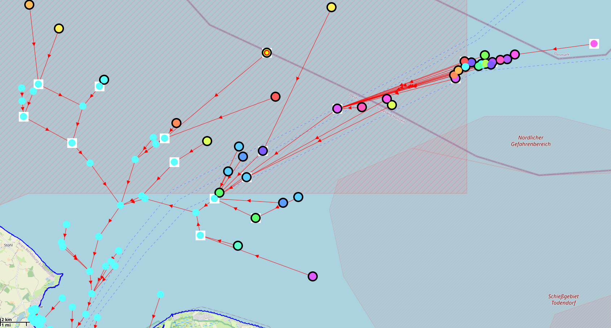
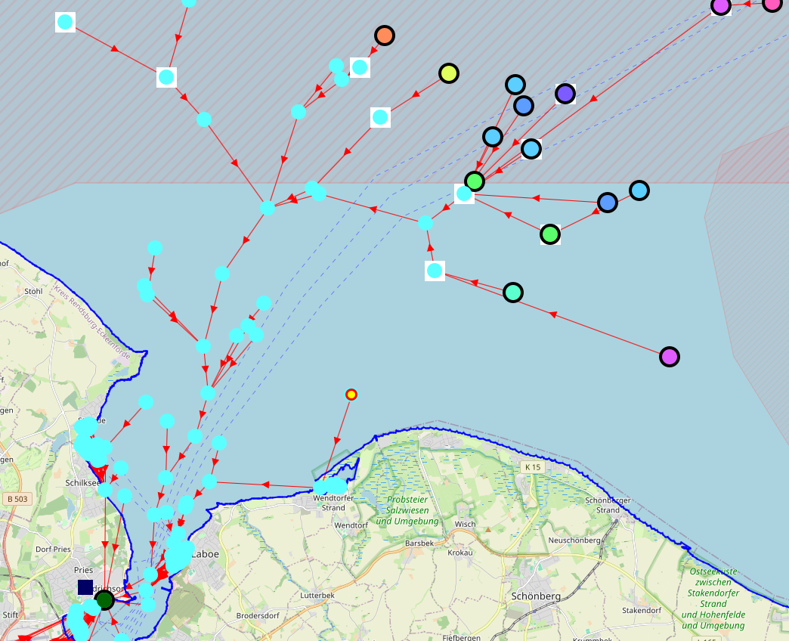
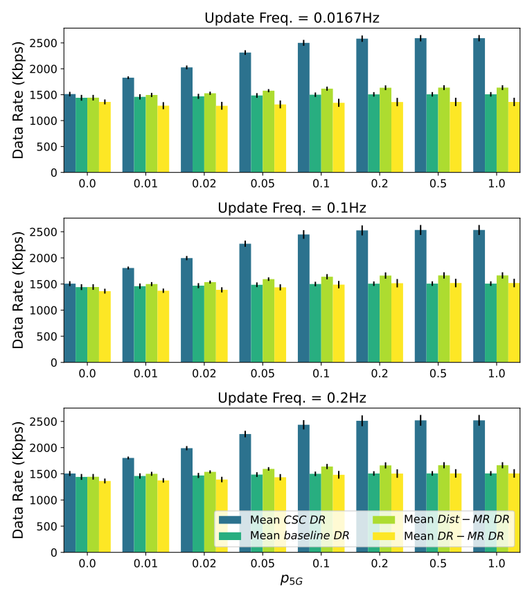
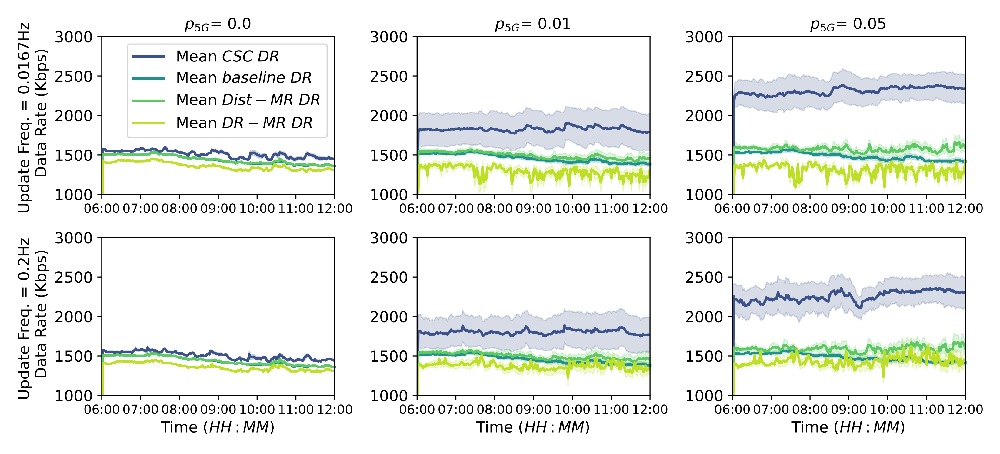
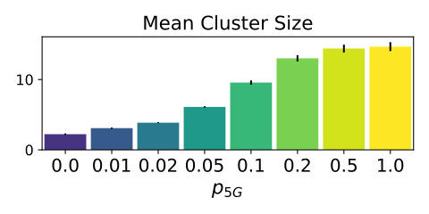
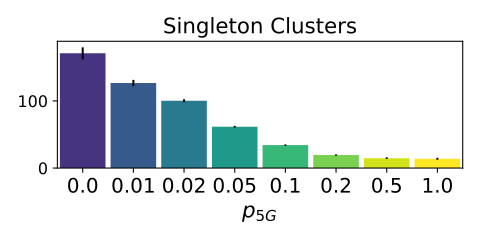
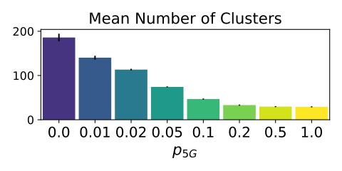
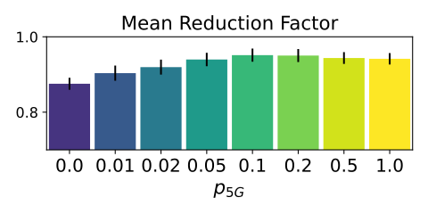

+++
pre = ""
title = "2025: Robust Communication through Collective Adaptive Relay Schemes for Maritime Vessels"
weight = 6
summary = "Multi-Relay Self-Adaptive Communication Network in Maritime Context for International Conference on Autonomic Computing and Self-Organizing Systems (2025)."
tags = ["simulation", "aggregate computing", "Self-adaptive Networks", "Self-organising Coordination Regions"]
hidden = true
+++

From 

Simulation and detailed description publicly available at [https://github.com/anitvam/experiment-2025-acsos-ship-clustered-comm](https://github.com/anitvam/experiment-2025-acsos-ship-clustered-comm) .

## Abstract

Maritime communication networks face unique challenges due to the dynamic and sparse distribution of vessels, variable environmental conditions, and heterogeneous technological constraints. With the increasing trend toward autonomy in maritime operations, these challenges become more pronounced.

Modern maritime navigation systems integrate numerous high-bandwidth sensors—including cameras and LiDAR—to enhance environmental perception, whose exploitation generates increased data rate demand. The increase is in contrast to traditional ship communication systems, which provide data rates in the order of kilobits per second.

This work proposes robust, multi-mean, collective adaptive software infrastructures to resiliently improve data collection by relaying data streams across multiple vessels. In particular, we introduce a method to form dynamic clusters of vessels whose information is summarised and then transmitted, raising the probability that the information reaches its destination. We validate our approach through simulation and show that the proposed clustering mechanism is capable of scaling up as new vessels are equipped with improved communication technologies.

## Experiment description

### Objective

The goal of this experiment is to evaluate the performance of different communication strategies for maritime vessels in the Kiel area. We evaluate the performance of the communication strategies in terms of data rate, i.e., the amount of data that can be communicated.

The communication algorithms compared in this experiment are:

Direct Communication: vessels communicate directly with shore stations, which is the current standard communication method. If vessels are out of range of communication with shore stations, they rely on satellite communication.
Distance-based Multi-Relay Communication (Dist-MR): vessels communicate relaying messages to each other to improve communication range. The relay is chosen based on the distance between vessels, i.e., the closest vessel to the sender is chosen as a relay.
Data Rate-based Multi-Relay Communication (DR-MR): vessels communicate relaying messages to each other to improve communication range. The relay is chosen based on the data rate, i.e., the vessel with which the data rate is highest is chosen as a relay.
Collective Summarization Clusters (CSC): Like Dist-MR but the vessels are grouped into clusters, and each cluster has a leader that collects the messages from the other vessels in the cluster and sends them to the nearest relay, which can be a shore station or another vessel in a cluster.

### Setup

The experiment uses Alchemist Simulator to simulate vessels movements taken from a six-hour time window from August 18, 2022, from 4:00 to 10:00 Universal Time Coordinated (UTC) (6:00 to 12:00 Central European Summer Time (CEST)—Kiel local time).

We assume each vessel to be equipped with:
- a VHF Automatic Packet Reporting System (APRS) device and a LoRaWAN class-C (bidirectional communication) device for long-range communication;
- a 5G consumer-grade module (similar to the ones used in mobile phones); and
- a Wi-Fi-direct capable device.

Furthermore, we assume that a vessel can be equipped with a probability 5G cellular tower p5G.

We use openly available data to locate the positions of the land stations. Similarly, we use openly available data to understand where the existing 5G infrastructure is located and their specific technology.

We assume that all ships intend to communicate a data stream d = 3 Mbit/s to the land station, approximately equivalent to the bitrate of a compressed 720p video stream.

We simulation is performed with two free variables:
- p5G: Controlling the probability of a vessel being equipped with a 5G tower. We let p5G range in [0, 0.01, 0.02, 0.05, 0.1, 0.5, 1].
- f: Controlling the aggregate program round frequency. We let f range in [1 / 60, 0.1, 0.2]Hz.
- Every experiment is performed 100 times, each time with a different seed.

  
  

### Results

Among the tested methods, 
CSC achieves the highest average data rate in all simulation configurations. 
In particular, CSC is also the approach that scales better as infrastructure improves, 
demonstrating better adaptability to the presence of 5G equipped vessels. 
The DR-MR generally underperforms, 
even compared with Dist-MR and the current baseline. 
This counterintuitive result is most likely due to vessels with a good data rate being overly selected and ending up with too many streams to relay, 
thus causing overuse of few channels and underuse of others. 
These results suggest that the approach could be amended, for instance, 
by considering the number of children per relay as a factor in the relay selection process.

## Images 

  
  

  
  
  
  

