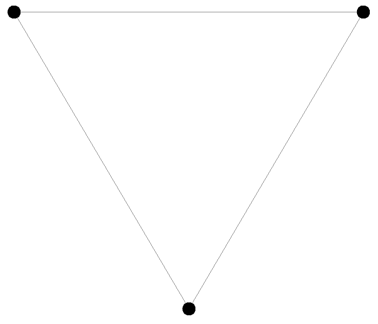
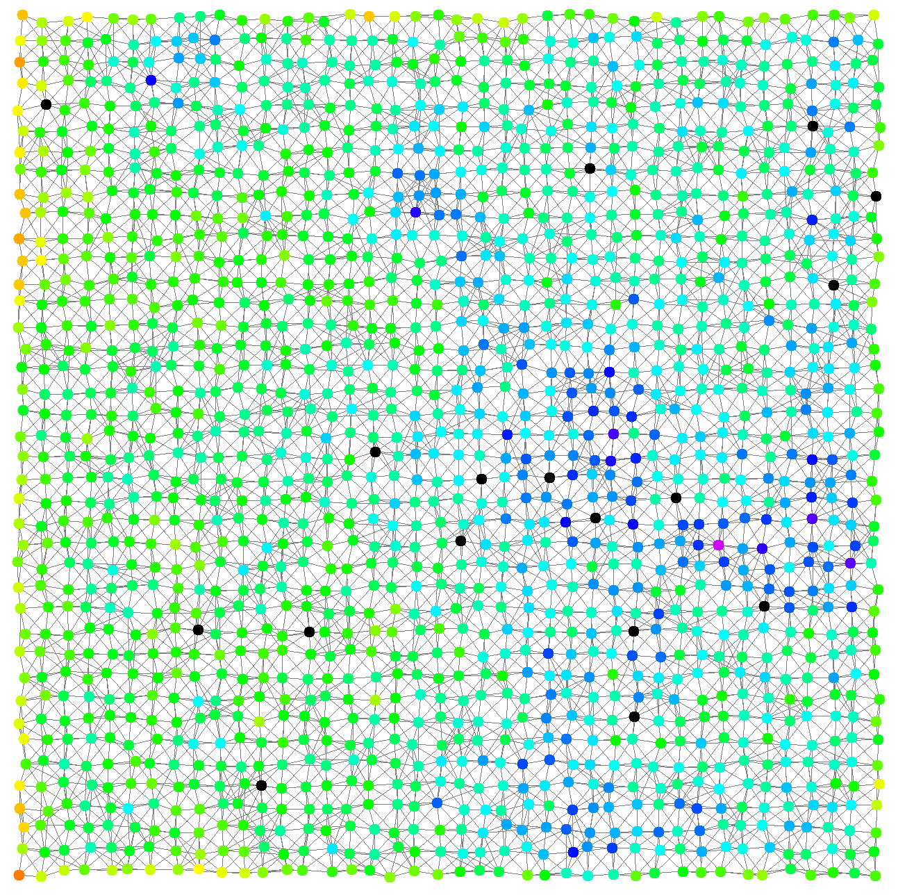

+++
title = "Step-by-step tutorial"
date = 2022-01-19T17:24:57+01:00
weight = 2
tags = ["tutorial", "basics", "video", "examples", "deployment", "maps", "indoor", "graph", "export"]
summary = "A (video) guide through the main features of the simulator, as presented at DAIS 2021"
+++

In this page, we show an up to date version the examples that are presented in the tutorial paper presented at
[DAIS 2021](https://www.discotec.org/2021/dais.html)
(one of the three conferences of [DisCoTec 2021](https://www.discotec.org/2021/)).

This tutorial features some companion videos, embedded in this page.

{}
The tutorial is also available as a scientific document: {}
{}

{}
All code has been open-sourced and it is being actively maintained on [GitHub](https://github.com/DanySK/DisCoTec-2021-Tutorial)
{}

{}
Snapshots presented here are from the Java Swing GUI module that was the main UI at the time the tutorial was written,
and may or may not reflect the current graphical appearance of the examples
(which can be configured in any case).
{}

{}
Simulations in alchemist are written in [YAML](https://yaml.org/).
YAML is pretty intuitive, it can be learnt quickly through
*[Learn X in Y minutes Where X=yaml](https://learnxinyminutes.com/docs/yaml/)*.
Even without any prior knowledge, looking at the syntax and comparing it with the information in the aforementioned page
should provide enough information.
{}

## Import the infrastructure

{}
You need to be able to import an existing Gradle project from GitHub.
If you have no idea of what I'm talking about,
[take a step back and make sure you followed the quickstart](../quickstart).
{}

1. `git clone git@github.com:DanySK/DisCoTec-2021-Tutorial.git`
2. `cd DisCoTec-2021-Tutorial`
3.
    * Unix-like terminals: `./gradlew run00`
    * Windows terminals (cmd, Powershell): `gradlew.bat run00`

The shell should begin to work, download the required components, and pop a graphical interface in front of you.

{}
If something went wrong, let us know by **[opening an issue](https://github.com/DanySK/DisCoTec-2021-Tutorial/issues/new/choose)**!

The build system is *continuous-integration sensitive*.
If a GUI is not displayed but the proces terminates successfully,
make sure that you do not have a `CI` environment variable set to `true`.
{}

## Writing and launching simple simulations

In this video you will see how to:
1. import the example project, and how to use it to run simulations;
2. write simple simulations in YAML;
3. deploy nodes into a bidimensional space; and
4. write programs that perform manipulation of data in form of tuples.

{}
This is actually the **second** video of the tutorial.
The first presents introductory information on the simulator and its meta-model,
it can be found in the [Explanation](/explanation/) chapter of the documentation.
{}



The examples presented in the video are presented in the following subsections,
updated to execute with the latest version of the simulator.
You will find this code in the current version of the tutorial.

{}
Make changes to the existing configuration files and see what happens!
{}

### Three connected devices

In this simple example, we simply deploy three nodes in a bidimensional space.
They do nothing, they are just there.
Starting the simulation would make it go to infinite time instantly,
as there are no events to simulate.



The graphic effect is just to see three dots in the interface.
If links are displayed (see the [reference of the graphical interface](/reference/default-ui)),
then the three nodes appear linked.
{}

{}

### A grid of devices playing dodgeball

In this example we create a grid of devices
and make them play dodgeball. The program to be injected is rather simple:
some nodes will begin the simulation with a ball, and their goal will be to
throw it to a random neighbor; whichever node gets hit takes a point, updates
its score, and throws the ball again. This program is easy to write in a network
of programmable tuple spaces, hence we write the following specification using
the SAPERE incarnation.



Snapshots of the simulation of the “dodgeball” example follow.
Devices with a ball are depicted in black. All other devices’ color hue depends on the
hit count, shifting from red (zero hits) towards blue.

{}

{}

### A gradient on a grid of devices

In this example, we implement with the SAPERE incarnation a very simple
specification of a gradient, a pattern that is considered to be the basis of many
other patterns [^bio-patterns]

[^bio-patterns]: 



Here are some snapshots of the simulation of the “gradient” example.
Source devices have a central black dot. Devices’ color hue depends on the gradient
value, shifting from red (low) towards blue (high).

{}

{}

### Arbitrary network graphs

This example showcases some complex deployments made possible by Alchemist via [Graphstream](https://graphstream-project.org/)



The example creates a single environment with three advanced deployments. From left to right: a
Lobster graph, a banana tree, and a scale-free network with preferential attachment.

## Advanced examples



In this video, we learn how to:
1. use aggregate programming (via Protelis) to write simulations;
2. use images to create indoor environments with physical obstacles;
3. use OpenStreetMap data to simulate on real-world maps; and
4. export data from simulations and configure batches exploring all possible combinations

### Node mobility and indoor environments

Many interesting scenarios the simulator targets
require mobility and a richer environment. In the following example, we show
a group of mobile devices estimating the distance from a point of interest (the
altar) while moving within a church, whose planimetry has been taken from
an existing building.
Since the gradient is propagated in a network of mobile devices, we use a Protelis implementation of the
adaptive Bellman-Ford algorithm from the Protelis-lang library[^protelis-lang]

[^protelis-lang]: 



In the following snapshots, mobile devices progressively explore the location, while measuring the distance from a point of interest
via gradient (red nodes are closer to the point of interest; purple ones are farther).

{}

{}

### Real-world maps and GPS traces

The simulator can
load data from OpenStreetMap exports, navigate devices towards a destination
along streets by relying on GraphHopper or by using GPS traces in GPX format,
or even using the navigation system to interpolate sparse GPS traces, thus
preventing nodes from taking impossible paths. In the following simple
scenario buoys are deployed in the Venice lagoon and move Brownianly.



The following snapshots depict the simulation in execution.

{}

{}

### In-depth analysis of simulated scenarios

The following snippet showcases the aforementioned features by enriching
the example of a gradient in an indoor environment presented previously with:

1. variables for the pedestrian walking speed, pedestrian count, and random seed;
2. constants to ease the configuration of the simulation;
3. a Kotlin resource search expressed as a variable;
4. controlled reproducibility by controlling random seeds;
5. export of generated data (time and several statistics on the gradient).



{}
This example:
* [controls randomness by specifying the random seeds](/howtos/simulation/repeatability),
* [uses variables to define multiple scenarios at once and don't repeat itself](/howtos/simulation/variables)
* [uses the data export infrastructure](/howtos/simulation/export)
  {}
