+++
title = "Step-by-step tutorial"
date = 2022-01-19T17:24:57+01:00
weight = 2
tags = ["quickstart", "installation", "execution"]
+++

In this page, we show an up to date version the examples that are presented in the tutorial paper presented at
[DAIS 2021](http://www.discotec.org/2021/dais.html)
(one of the three conferences of [DisCoTec 2021](https://www.discotec.org/2021/)).

The tutorial is also available as a scientific document: {}

Snapshots presented here are from the Java Swing GUI module that was the main UI at the time the tutorial was written,
and may or may not reflect the current graphical appearance of the examples
(which can be configured in any case).
Further details on the examples are available in the tutorial paper.

This tutorial features three companion videos, embedded in this page.

## Introductory information

The first video presents introductory information on the simulator and its meta-model.
It can be found in the [Explanation](/explanation/) chapter of the documentation.

Simulations in alchemist are written in [YAML](https://yaml.org/).
YAML is pretty intuitive, it can be learnt quickly through
*[Learn X in Y minutes Where X=yaml](https://learnxinyminutes.com/docs/yaml/)*.
Even without any prior knowledge, looking at the syntax and comparing it with the information in the aforementioned page
should provide enough information.

## Writing and launching simple simulations



In this video you will see how to:
1. import the example project, and how to use it to run simulations;
2. write simple simulations in YAML;
3. deploy nodes into a bidimensional space; and
4. write programs that perform manipulation of data in form of tuples.

The examples presented in the video are presented in the following subsections,
updated to execute with the latest version of the simulator.
You will find this code in the current version of the tutorial.

### Three connected devices

In this simple example, we simply deploy three nodes in a bidimensional space.
They do nothing, they are just there.
Starting the simulation would make it go to infinite time instantly,
as there are no events to simulate.



The graphic effect is just to see three dots in the interface.
If links are displayed (see the [reference of the graphical interface](/reference/default-ui)),
then the three nodes appear linked.

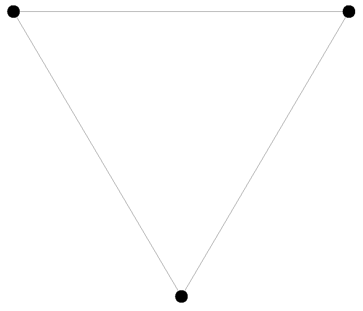

### A grid of devices playing dodgeball

In this example we create a grid of devices
and make them play dodgeball. The program to be injected is rather simple:
some nodes will begin the simulation with a ball, and their goal will be to
throw it to a random neighbor; whichever node gets hit takes a point, updates
its score, and throws the ball again. This program is easy to write in a network
of programmable tuple spaces, hence we write the following specification using
the SAPERE incarnation.



Snapshots of the simulation of the “dodgeball” example follow.
Devices with a ball are depicted in black. All other devices’ color hue depends on the
hit count, shifting from red (zero hits) towards blue.

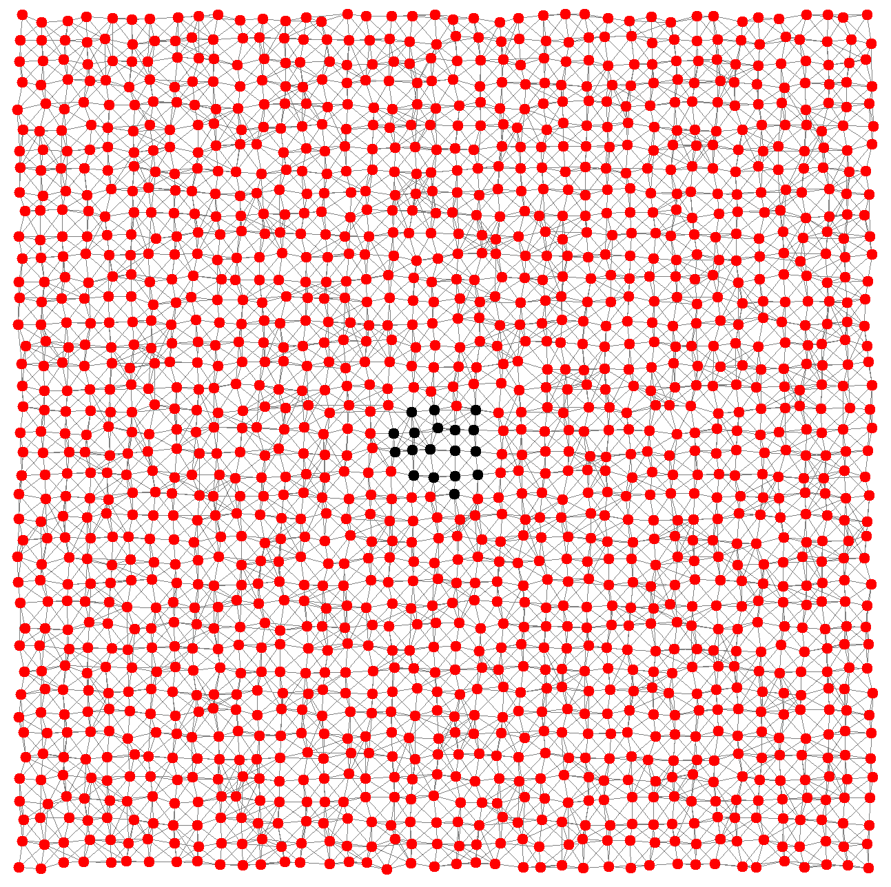
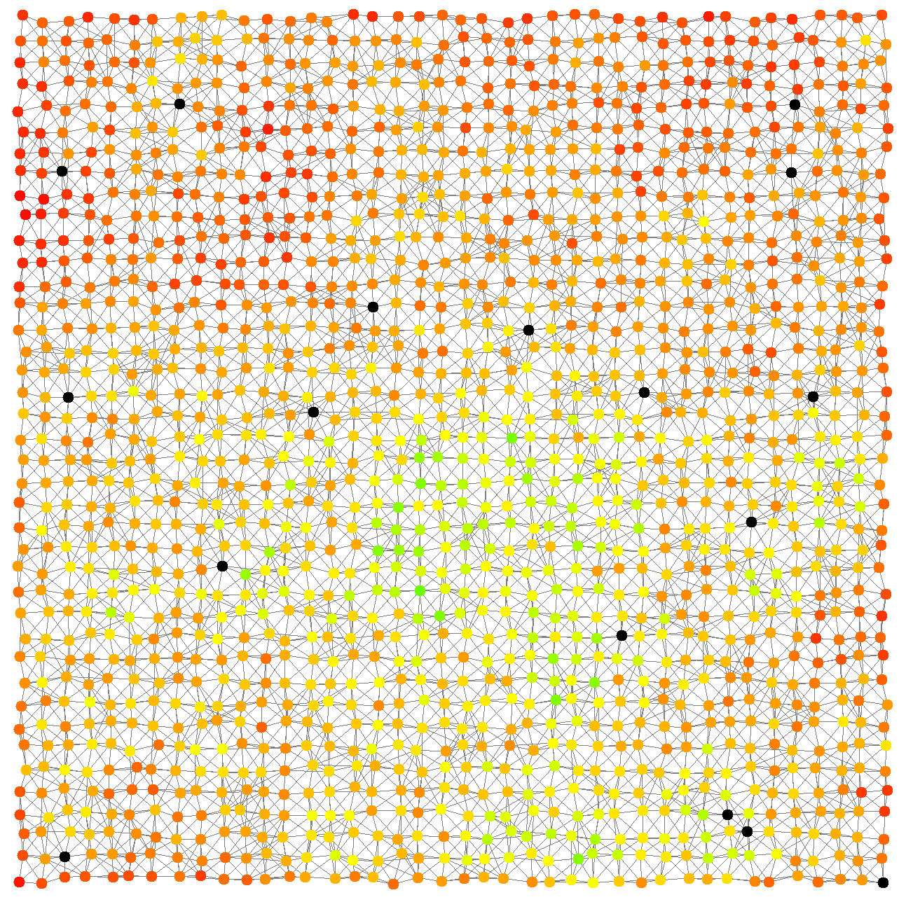
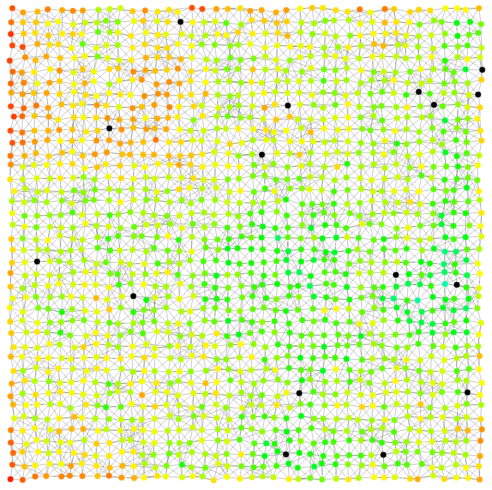

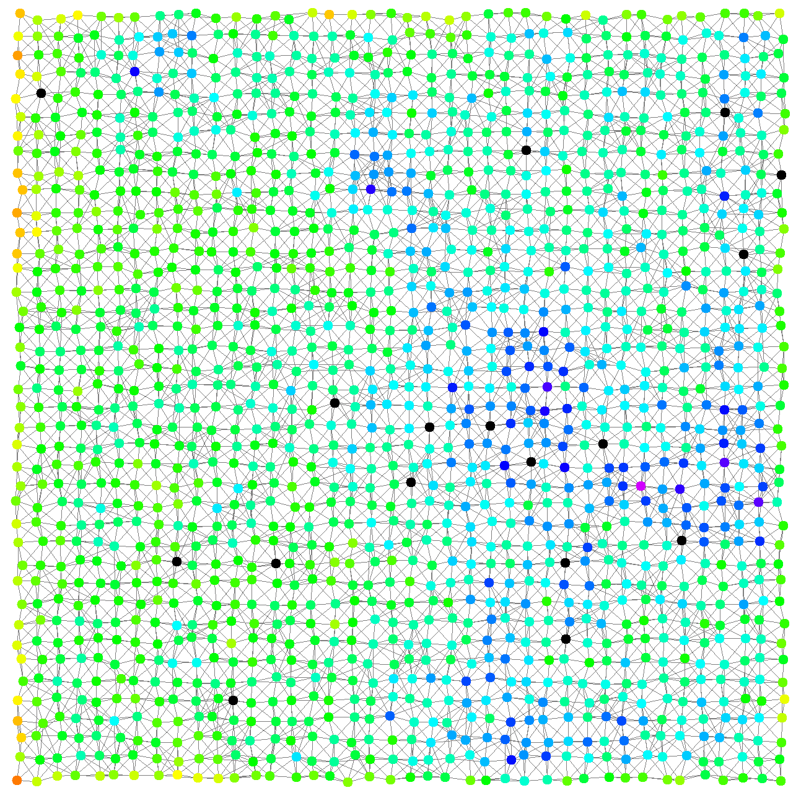

### A gradient on a grid of devices

In this example, we implement with the SAPERE incarnation a very simple
specification of a gradient, a pattern that is considered to be the basis of many
other patterns [^bio-patterns]

[^bio-patterns]: 



Here are some snapshots of the simulation of the “gradient” example.
Source devices have a central black dot. Devices’ color hue depends on the gradient
value, shifting from red (low) towards blue (high).

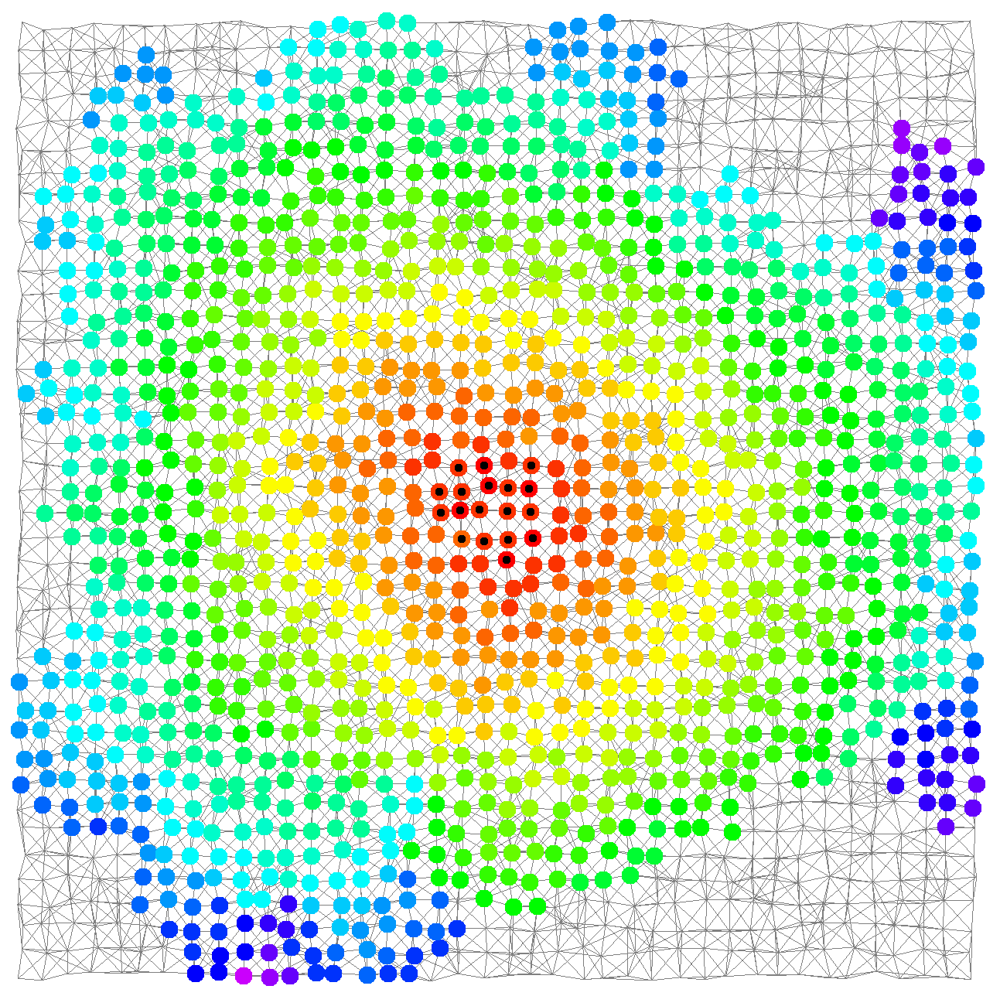
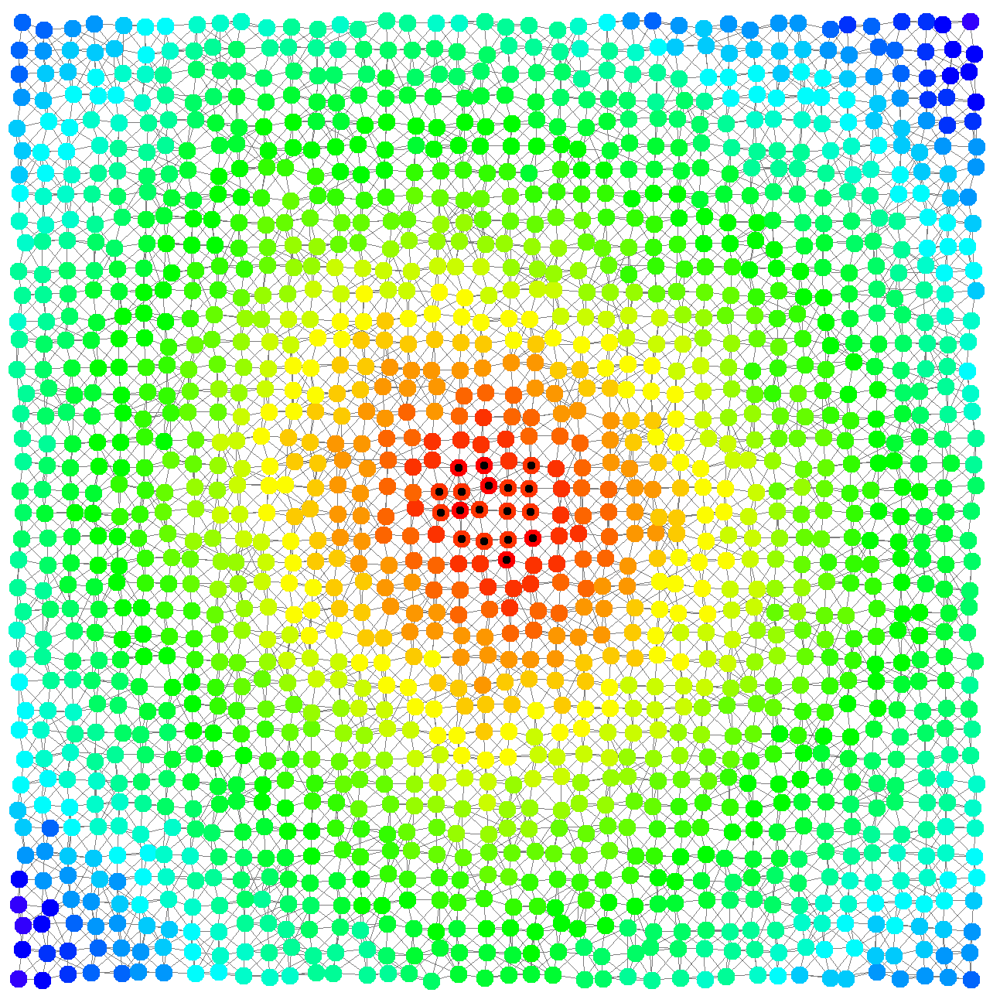

### Arbitrary network graphs

This example showcases some complex deployments made possible by Alchemist via [Graphstream](https://graphstream-project.org/)



The example creates a single environment with three advanced deployments. From left to right: a
Lobster graph, a banana tree, and a scale-free network with preferential attachment.

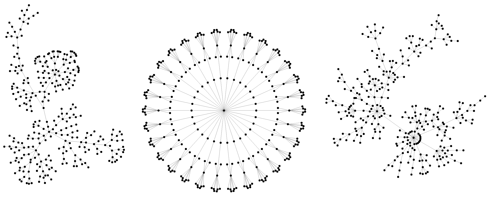

## Advanced examples



In this video, we learn how to:
1. use aggregate programming (via Protelis) to write simulations;
2. use images to create indoor environments with physical obstacles;
3. use OpenStreetMap data to simulate on real-world maps; and
4. export data from simulations and configure batches exploring all possible combinations

### Node mobility and indoor environments

Many interesting scenarios the simulator targets
require mobility and a richer environment. In the following example, we show
a group of mobile devices estimating the distance from a point of interest (the
altar) while moving within a church, whose planimetry has been taken from
an existing building.
Since the gradient is propagated in a network of mobile devices, we use a Protelis implementation of the
adaptive Bellman-Ford algorithm from the Protelis-lang library[^protelis-lang]

[^protelis-lang]: 



In the following snapshots, mobile devices progressively explore the location, while measuring the distance from a point of interest
via gradient (red nodes are closer to the point of interest; purple ones are farther).

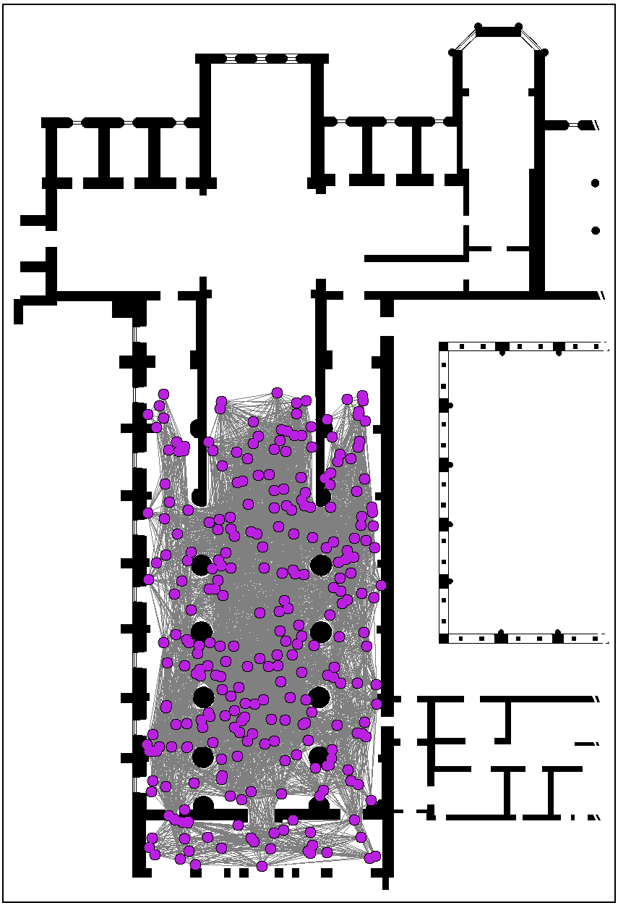

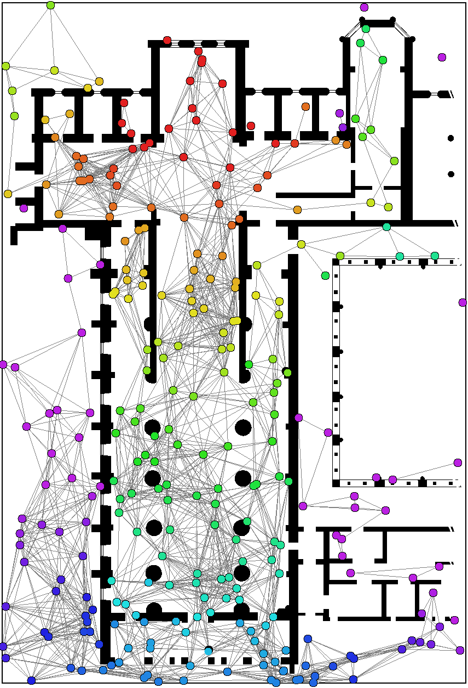

### Real-world maps and GPS traces

The simulator can
load data from OpenStreetMap exports, navigate devices towards a destination
along streets by relying on GraphHopper or by using GPS traces in GPX format,
or even using the navigation system to interpolate sparse GPS traces, thus
preventing nodes from taking impossible paths. In the following simple
scenario buoys are deployed in the Venice lagoon and move Brownianly.



The following snapshots depict the simulation in execution.

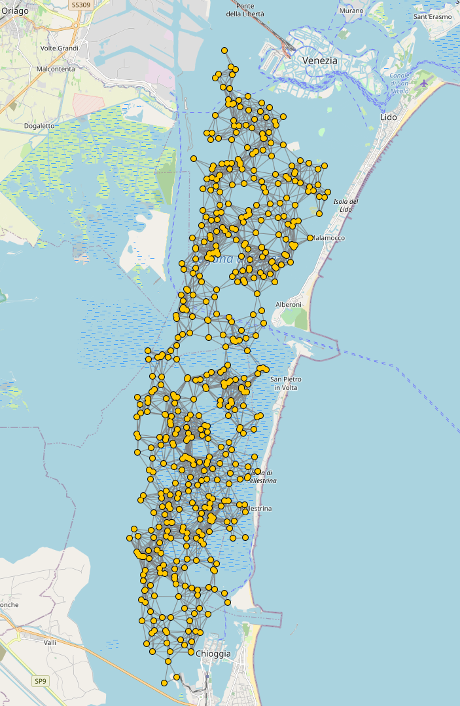

### In-depth analysis of simulated scenarios

Debugging a simulation requires the ability to reproduce the same behavior multiple times: an unexpected behavior requiring investigation may happen
far into the simulation, or in corner conditions encountered by chance.
Randomness is controlled by setting the random generator seeds separately for the deployments and the simulation execution, allowing
for running different simulations on the same random deployment. Seeds are
set at the top level of the simulation specification.

Alchemist provides first-class support for executing multiple simulations with
varying conditions. Variables can be listed in the variables section of the simulation descriptor.
Every variable has a default value and a way to generate
other values. When a batch execution is requested, the cartesian product of all
possible values for the selected variables is produced, the default values are used
for non-selected variables, and then for each entry, a simulation is prepared and
then executed (execution can be and usually is performed in parallel).

Moreover, to favor reusability and
apply the DRY principle, the simulator allows defining variables whose values
possibly depend on values of other variables. Their values can be expressed in
any JSR22310 -compatible language (thereby including Scala, Kotlin, JavaScript,
Ruby, Python, and Groovy), using Groovy as default.

Finally, the simulator provides tools for exporting data automatically. An
export section on the simulation file instructs which data is considered interest-
ing, and should be thus exported with the selected sampling frequency. Data can
be exported separately for each node, or can be aggregated on the fly using any
univariate statistic function (e.g., mean, sum, product, percentile, median...).
The treatment of missing or non-finite values can be specified as well. Results
are exported in comma-separated values files, easily importable in a variety of
data analysis tools.

The following snippet showcases the aforementioned features by enriching
the example of a gradient in an indoor environment presented previously with:

1. variables for the pedestrian walking speed, pedestrian count, and random seed;
2. constants to ease the configuration of the simulation;
3. a Kotlin resource search expressed as a variable;
4. controlled reproducibility by controlling random seeds;
5. export of generated data (time and several statistics on the gradient).


